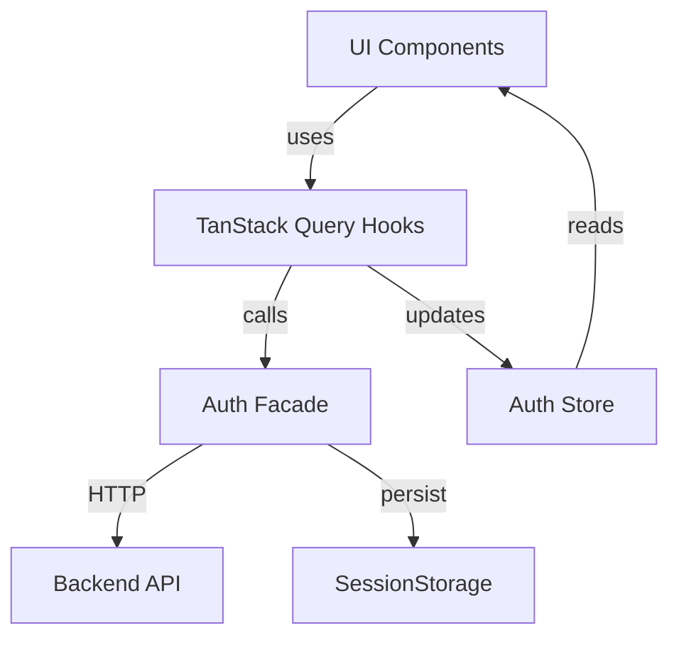
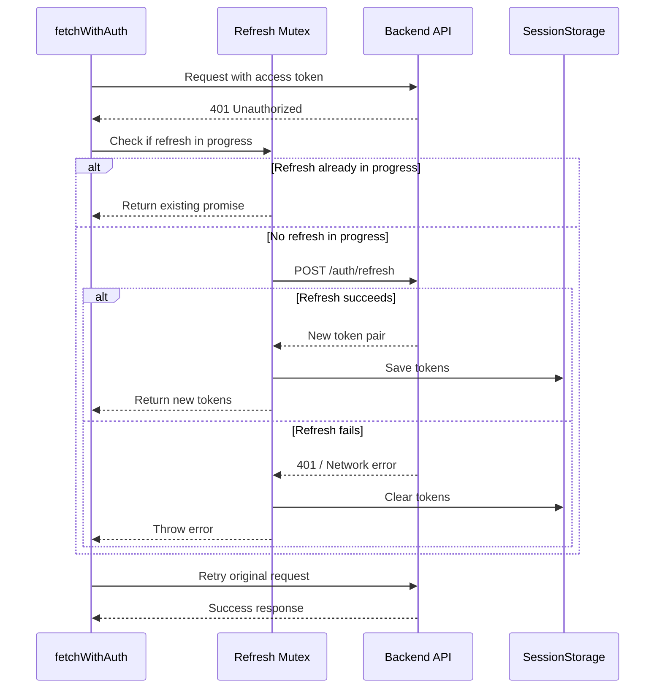
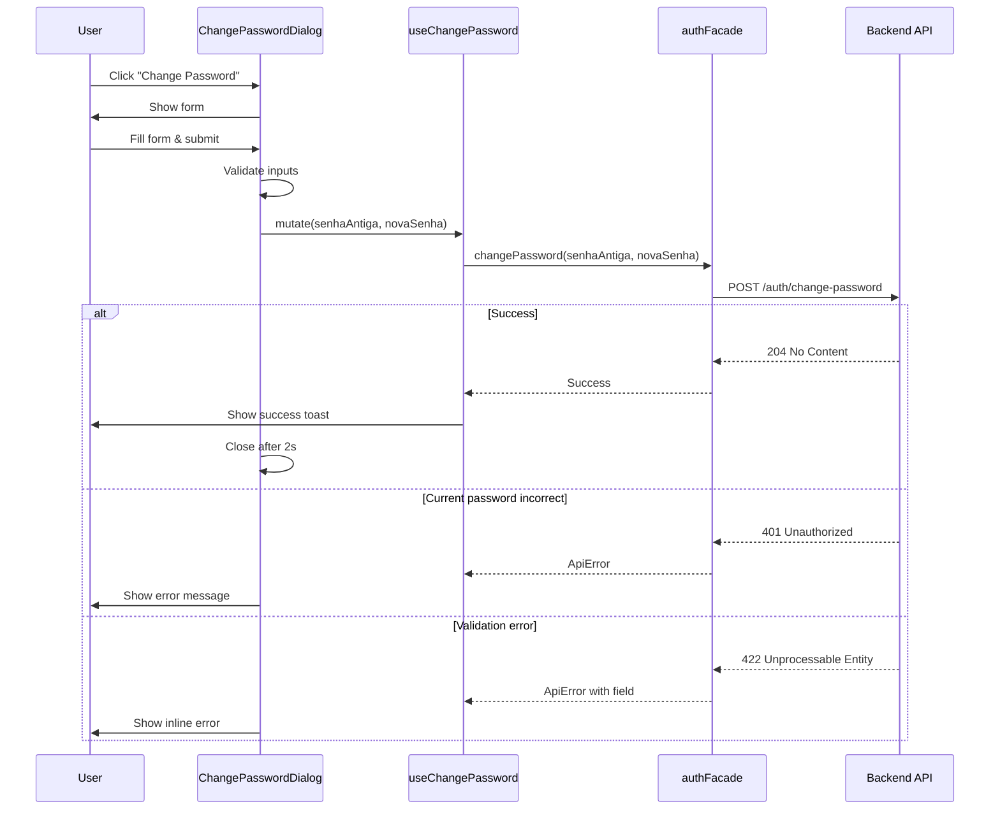
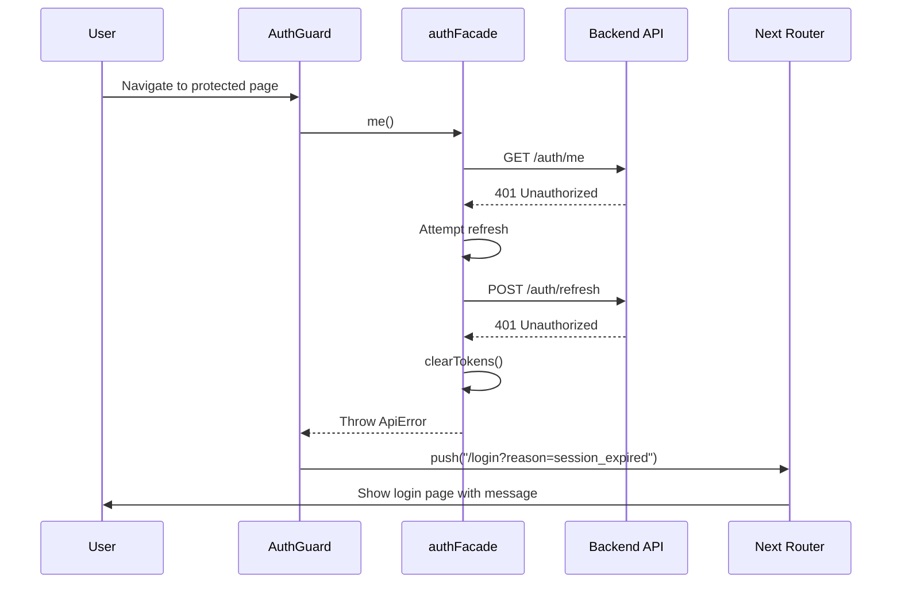

# Design Document — Authentication Enhancements

## Overview

This design specifies technical enhancements to the existing authentication system in GOVMOBI-ADMIN. The enhancements focus on three core areas:

1. **Token Lifecycle Management**: Robust token refresh with mutex pattern, retry logic, and proper error handling
2. **API Coverage**: Complete implementation of all `/auth/*` endpoints including the new `changePassword` method
3. **User Experience**: Change password functionality with accessible modal dialog

The design builds upon the existing authentication implementation (`.kiro/specs/authentication/`) and integrates seamlessly with the current facade pattern, TanStack Query hooks, and Zustand state management.

### Key Design Principles

- **Transparency**: Token refresh happens silently without user interruption
- **Resilience**: Network errors trigger retries; only authentication failures force re-login
- **Type Safety**: Strong TypeScript types for all auth operations
- **Accessibility**: WCAG 2.1 AA compliance for all UI components
- **Testability**: MSW mocks enable development without backend dependency

## Architecture

### System Context



### Token Refresh Flow



### Change Password Flow



## Components and Interfaces

### 1. Auth Facade Enhancements

**File**: `src/facades/authFacade.ts`

#### New Types

```typescript
export interface ChangePasswordInput {
  senhaAntiga: string;
  novaSenha: string;
}

export type {
  AuthUser,
  TokenPair,
  LoginInput,
  RegisterInput,
  ChangePasswordInput,
};
```

#### New Method

```typescript
/**
 * Changes the authenticated user's password.
 *
 * @param senhaAntiga - Current password for verification
 * @param novaSenha - New password (must be at least 8 characters)
 * @returns Promise<void> (204 No Content response)
 * @throws ApiError 401 when current password is incorrect
 * @throws ApiError 422 on validation errors
 */
async changePassword(
  senhaAntiga: string,
  novaSenha: string
): Promise<void>
```

#### Enhanced Token Management

**Logging** (development only):
- Token save: `console.log("Tokens saved")`
- Token clear: `console.log("Tokens cleared")`
- Refresh initiated: `console.log("Token refresh initiated")`
- Refresh success: `console.log("Token refresh succeeded")`
- Refresh failure: `console.log("Token refresh failed:", reason)`

**Retry Logic** (in `refresh()` method):
```typescript
// Retry configuration
const MAX_RETRIES = 2;
const RETRY_DELAYS = [1000, 2000]; // Exponential backoff

// Retry only on network errors and 5xx server errors
// Do NOT retry on 401 (authentication failure)
```

#### Enhanced fetchWithAuth

**Concurrent Request Handling**:
```typescript
// Module-scoped mutex
let refreshPromise: Promise<TokenPair> | null = null;

// In fetchWithAuth:
if (response.status === 401 && refreshToken) {
  // Reuse existing refresh promise if one is in flight
  if (!refreshPromise) {
    refreshPromise = authFacade.refresh();
  }
  
  try {
    const tokens = await refreshPromise;
    // Retry original request with new token
  } finally {
    refreshPromise = null;
  }
}
```

### 2. Change Password Hook

**File**: `src/hooks/auth/useChangePassword.ts`

```typescript
import { useMutation } from "@tanstack/react-query";
import { toast } from "sonner";
import { authFacade } from "@/facades/authFacade";
import type { ApiError } from "@/types";

export interface UseChangePasswordParams {
  senhaAntiga: string;
  novaSenha: string;
}

/**
 * Mutation hook for changing the authenticated user's password.
 *
 * On success, displays a success toast. On error, the component
 * handles error display (no toast).
 *
 * @returns TanStack Query mutation object
 */
export function useChangePassword() {
  return useMutation<void, ApiError, UseChangePasswordParams>({
    mutationFn: ({ senhaAntiga, novaSenha }) =>
      authFacade.changePassword(senhaAntiga, novaSenha),
    
    onSuccess: () => {
      toast.success("Password changed successfully");
    },
    
    // No onError — dialog handles error display
  });
}
```

### 3. Change Password Dialog

**File**: `src/components/molecules/ChangePasswordDialog.tsx`

```typescript
export interface ChangePasswordDialogProps {
  open: boolean;
  onClose: () => void;
  "data-testid"?: string;
}

/**
 * Modal dialog for changing the authenticated user's password.
 *
 * Features:
 * - Three-field form: Current Password, New Password, Confirm New Password
 * - Client-side validation: min 8 chars, passwords match
 * - Server-side error handling: 401 (wrong password), 422 (validation)
 * - Success state: shows message, auto-closes after 2s
 * - Full keyboard navigation and ARIA support
 *
 * @param props.open - Whether the dialog is visible
 * @param props.onClose - Callback to close the dialog
 * @returns Accessible modal form dialog
 */
export function ChangePasswordDialog({
  open,
  onClose,
  "data-testid": testId,
}: ChangePasswordDialogProps): React.ReactElement | null
```

**Form Fields**:
- `senhaAntiga`: Current password (type="password", required)
- `novaSenha`: New password (type="password", required, minLength=8)
- `confirmarSenha`: Confirm new password (type="password", required)

**Validation Rules**:
1. All fields required
2. `novaSenha` must be at least 8 characters
3. `confirmarSenha` must match `novaSenha`
4. Validation runs on submit and on blur for touched fields

**Error Handling**:
- **401**: Display "Current password is incorrect" below `senhaAntiga` field
- **422**: Display API validation message inline on relevant field
- **Network Error**: Display "Network connection failed. Please check your internet connection and try again."

**Success Flow**:
1. Display success message: "Password changed successfully"
2. Wait 2 seconds
3. Call `onClose()`

**Accessibility**:
- Tab order: Current Password → New Password → Confirm → Cancel → Submit
- `aria-invalid="true"` on fields with errors
- `aria-describedby` links error messages to inputs
- `aria-busy="true"` on submit button while pending
- Focus trap within modal
- Auto-focus on "Current Password" when opened
- Escape key closes dialog

### 4. Admin Shell Integration

**File**: `src/components/organisms/AdminShell.tsx`

**Changes**:
- Add "Change Password" menu item to user profile dropdown
- Import and render `ChangePasswordDialog`
- Manage dialog open/close state

```typescript
// In AdminShell component:
const [isChangePasswordOpen, setIsChangePasswordOpen] = useState(false);

// In user dropdown menu:
<button onClick={() => setIsChangePasswordOpen(true)}>
  {t("auth:changePassword.menuItem")}
</button>

// At component root:
<ChangePasswordDialog
  open={isChangePasswordOpen}
  onClose={() => setIsChangePasswordOpen(false)}
/>
```

### 5. MSW Mock Handler

**File**: `src/msw/authHandlers.ts`

**New Handler**:
```typescript
http.post(`${BASE_URL}/auth/change-password`, async ({ request }) => {
  await delay(latency());
  
  const authHeader = request.headers.get("Authorization");
  if (!authHeader || !authHeader.startsWith("Bearer ")) {
    return HttpResponse.json(
      { code: "UNAUTHORIZED", message: "Missing or invalid token" },
      { status: 401 }
    );
  }
  
  const body = await request.json() as ChangePasswordInput;
  
  // Simulate incorrect current password
  if (body.senhaAntiga !== VALID_SENHA) {
    return HttpResponse.json(
      { code: "UNAUTHORIZED", message: "Current password is incorrect" },
      { status: 401 }
    );
  }
  
  // Simulate validation error
  if (body.novaSenha.length < 8) {
    return HttpResponse.json(
      {
        code: "VALIDATION_ERROR",
        message: "Password must be at least 8 characters",
        field: "novaSenha"
      },
      { status: 422 }
    );
  }
  
  // Success
  return new HttpResponse(null, { status: 204 });
})
```

## Data Models

### Token Pair

```typescript
export interface TokenPair {
  accessToken: string;
  refreshToken: string;
}
```

**Storage Keys**:
- Access token: `govmobile.access_token`
- Refresh token: `govmobile.refresh_token`

**Storage Location**: `sessionStorage` (survives page refresh, cleared on tab close)

### Change Password Input

```typescript
export interface ChangePasswordInput {
  senhaAntiga: string;
  novaSenha: string;
}
```

**API Endpoint**: `POST /auth/change-password`

**Request Body**:
```json
{
  "senhaAntiga": "currentPassword123",
  "novaSenha": "newPassword456"
}
```

**Response**: `204 No Content` on success

### API Error Response

```typescript
export interface ApiErrorPayload {
  code: string;
  message: string;
  field?: string; // Present on 422 validation errors
}
```

**Common Error Codes**:
- `UNAUTHORIZED`: 401 — Invalid credentials or expired token
- `VALIDATION_ERROR`: 422 — Input validation failed
- `NETWORK_ERROR`: 0 — Fetch threw (no network connection)

## Error Handling

### Token Refresh Errors

**Scenario 1: Network Error During Refresh**
- **Trigger**: `fetch()` throws in `refresh()` method
- **Action**: Retry up to 2 times with exponential backoff (1s, 2s)
- **Final Failure**: Clear tokens, throw `ApiError` with code `NETWORK_ERROR`
- **User Impact**: Redirected to login with `?reason=session_expired`

**Scenario 2: 401 During Refresh**
- **Trigger**: Refresh token expired or invalid
- **Action**: Clear tokens immediately, no retry
- **User Impact**: Redirected to login with `?reason=session_expired`

**Scenario 3: 5xx Server Error During Refresh**
- **Trigger**: Backend unavailable
- **Action**: Retry up to 2 times with exponential backoff
- **Final Failure**: Clear tokens, redirect to login

### Change Password Errors

**Scenario 1: Incorrect Current Password**
- **HTTP**: 401 Unauthorized
- **Display**: Inline error below "Current Password" field
- **Message**: `auth:changePassword.errors.incorrectPassword`

**Scenario 2: Validation Error (Password Too Short)**
- **HTTP**: 422 Unprocessable Entity
- **Display**: Inline error below "New Password" field
- **Message**: API-provided message from `field` property

**Scenario 3: Network Error**
- **HTTP**: Fetch throws
- **Display**: General error message at top of form
- **Message**: `auth:errors.networkError`

**Scenario 4: Passwords Don't Match (Client-Side)**
- **Validation**: Before API call
- **Display**: Inline error below "Confirm Password" field
- **Message**: `auth:validation.passwordMismatch`

### Session Expiry Flow



## Testing Strategy

### Unit Tests

**Auth Facade** (`src/facades/__tests__/authFacade.test.ts`):
- ✓ `changePassword()` calls correct endpoint with correct payload
- ✓ `changePassword()` throws on 401 response
- ✓ `changePassword()` throws on 422 response
- ✓ `changePassword()` throws on network error
- ✓ Token logging only runs in development mode
- ✓ `saveTokens()` writes to sessionStorage with correct keys
- ✓ `clearTokens()` removes both keys from sessionStorage
- ✓ `loadTokens()` reads from sessionStorage on module init

**fetchWithAuth** (`src/facades/__tests__/fetchWithAuth.test.ts`):
- ✓ Attaches Authorization header with access token
- ✓ On 401, attempts silent refresh and retries request
- ✓ On 401 with no refresh token, throws immediately
- ✓ Concurrent 401s trigger only one refresh call
- ✓ All queued requests retry after successful refresh
- ✓ All queued requests fail after failed refresh

**Token Refresh** (`src/facades/__tests__/tokenRefresh.test.ts`):
- ✓ Refresh mutex prevents concurrent refresh calls
- ✓ Refresh retries on network error (up to 2 times)
- ✓ Refresh does NOT retry on 401
- ✓ Refresh clears tokens on final failure
- ✓ Exponential backoff delays: 1s, 2s

**useChangePassword Hook** (`src/hooks/auth/__tests__/useChangePassword.test.ts`):
- ✓ Calls `authFacade.changePassword()` with correct params
- ✓ Shows success toast on success
- ✓ Does NOT show error toast on failure
- ✓ Returns correct mutation state (isPending, isError, isSuccess)

**ChangePasswordDialog** (`src/components/molecules/__tests__/ChangePasswordDialog.test.tsx`):
- ✓ Renders form with three password fields
- ✓ Validates new password is at least 8 characters
- ✓ Validates new password and confirm password match
- ✓ Displays inline error on 401 (incorrect current password)
- ✓ Displays inline error on 422 (validation error)
- ✓ Displays general error on network error
- ✓ Shows success message and auto-closes after 2s on success
- ✓ Closes on Escape key press
- ✓ Closes on Cancel button click
- ✓ Disables all inputs while submitting
- ✓ Sets `aria-busy="true"` on submit button while pending
- ✓ Sets `aria-invalid="true"` on fields with errors
- ✓ Links error messages to inputs via `aria-describedby`
- ✓ Auto-focuses "Current Password" field on open
- ✓ Tab order: Current → New → Confirm → Cancel → Submit

### Integration Tests

**Token Refresh Integration** (`src/facades/__tests__/tokenRefreshIntegration.test.ts`):
- ✓ End-to-end: 401 → refresh → retry → success
- ✓ End-to-end: 401 → refresh fails → tokens cleared → error thrown
- ✓ Multiple concurrent requests wait for single refresh

**Change Password Integration** (`src/components/molecules/__tests__/ChangePasswordIntegration.test.tsx`):
- ✓ Full flow: open dialog → fill form → submit → success toast → dialog closes
- ✓ Error flow: submit with incorrect password → error displayed → dialog stays open
- ✓ Validation flow: submit with short password → inline error → dialog stays open

### MSW Mock Coverage

**Auth Handlers** (`src/msw/__tests__/authHandlers.test.ts`):
- ✓ POST `/auth/change-password` returns 204 on valid input
- ✓ POST `/auth/change-password` returns 401 on incorrect current password
- ✓ POST `/auth/change-password` returns 422 on short new password
- ✓ POST `/auth/change-password` returns 401 on missing Authorization header
- ✓ Simulated latency between 200–500ms

### Accessibility Testing

**Manual Testing Checklist**:
- [ ] Keyboard navigation through entire change password flow
- [ ] Screen reader announces all form labels and errors
- [ ] Focus trap works correctly in modal
- [ ] Escape key closes modal
- [ ] Success message announced to screen readers
- [ ] Error messages announced to screen readers
- [ ] All interactive elements have visible focus indicators

**Automated Testing** (via jest-axe):
- ✓ ChangePasswordDialog has no axe violations when open
- ✓ ChangePasswordDialog has no axe violations with errors displayed
- ✓ ChangePasswordDialog has no axe violations in success state

## Implementation Notes

### Token Persistence Strategy

**Why sessionStorage?**
- ✓ Survives page refresh (better UX than memory-only)
- ✓ Cleared on tab close (better security than localStorage)
- ✓ Not accessible to other tabs (reduces attack surface)
- ✓ Not sent with HTTP requests (unlike cookies)

**Security Considerations**:
- Tokens are still vulnerable to XSS attacks
- HttpOnly cookies would be more secure but require backend changes
- Current approach balances security and implementation complexity

### Refresh Mutex Pattern

**Why a mutex?**
- Prevents duplicate refresh requests when multiple API calls fail simultaneously
- Reduces backend load
- Ensures all requests use the same new token

**Implementation**:
```typescript
let refreshPromise: Promise<TokenPair> | null = null;

async function refresh(): Promise<TokenPair> {
  if (refreshPromise) {
    return refreshPromise; // Reuse in-flight request
  }
  
  refreshPromise = (async () => {
    // ... actual refresh logic
  })();
  
  try {
    return await refreshPromise;
  } finally {
    refreshPromise = null; // Reset for next refresh
  }
}
```

### Retry Logic Design

**Retry Decision Tree**:
```
Error Type
├─ Network Error (fetch throws)
│  └─ Retry up to 2 times with backoff
├─ 5xx Server Error
│  └─ Retry up to 2 times with backoff
├─ 401 Unauthorized
│  └─ Do NOT retry, clear tokens immediately
└─ Other 4xx Errors
   └─ Do NOT retry, throw error
```

**Exponential Backoff**:
- Attempt 1: Immediate
- Attempt 2: Wait 1 second
- Attempt 3: Wait 2 seconds
- Total max delay: 3 seconds

### i18n Keys

**New Keys Required**:

`src/i18n/locales/en/auth.json`:
```json
{
  "changePassword": {
    "menuItem": "Change Password",
    "title": "Change Password",
    "currentPasswordLabel": "Current Password",
    "currentPasswordPlaceholder": "Enter your current password",
    "newPasswordLabel": "New Password",
    "newPasswordPlaceholder": "Minimum 8 characters",
    "confirmPasswordLabel": "Confirm New Password",
    "confirmPasswordPlaceholder": "Re-enter your new password",
    "submitButton": "Change Password",
    "cancelButton": "Cancel",
    "successMessage": "Password changed successfully",
    "errors": {
      "incorrectPassword": "Current password is incorrect",
      "passwordTooShort": "Password must be at least 8 characters",
      "passwordMismatch": "Passwords do not match"
    }
  }
}
```

`src/i18n/locales/pt-BR/auth.json`:
```json
{
  "changePassword": {
    "menuItem": "Alterar Senha",
    "title": "Alterar Senha",
    "currentPasswordLabel": "Senha Atual",
    "currentPasswordPlaceholder": "Digite sua senha atual",
    "newPasswordLabel": "Nova Senha",
    "newPasswordPlaceholder": "Mínimo 8 caracteres",
    "confirmPasswordLabel": "Confirmar Nova Senha",
    "confirmPasswordPlaceholder": "Digite novamente a nova senha",
    "submitButton": "Alterar Senha",
    "cancelButton": "Cancelar",
    "successMessage": "Senha alterada com sucesso",
    "errors": {
      "incorrectPassword": "Senha atual incorreta",
      "passwordTooShort": "A senha deve ter pelo menos 8 caracteres",
      "passwordMismatch": "As senhas não coincidem"
    }
  }
}
```

### Backward Compatibility

**No Breaking Changes**:
- All existing auth methods maintain their signatures
- Token storage keys remain unchanged
- Auth store interface unchanged
- Existing hooks continue to work without modification

**Additive Changes Only**:
- New `changePassword()` method added to facade
- New `useChangePassword()` hook added
- New `ChangePasswordDialog` component added
- New menu item added to AdminShell

### Development Workflow

**With MSW**:
1. Start dev server: `npm run dev`
2. MSW intercepts all `/auth/*` requests
3. Use `VALID_SENHA = "GovMob@2026"` for testing
4. Change password flow works end-to-end in browser

**Without MSW** (production):
1. Backend must implement `POST /auth/change-password`
2. Backend must return 204 on success
3. Backend must return 401 on incorrect current password
4. Backend must return 422 on validation errors

## Open Questions

1. **Token Expiry Times**: What are the actual access token and refresh token TTLs from the backend?
   - **Impact**: Affects how often refresh is triggered
   - **Recommendation**: Document in API contract

2. **Password Complexity Requirements**: Does the backend enforce additional password rules (uppercase, numbers, special chars)?
   - **Impact**: Client-side validation should match backend rules
   - **Recommendation**: Add to requirements if needed

3. **Rate Limiting**: Does the backend rate-limit password change attempts?
   - **Impact**: May need to handle 429 responses
   - **Recommendation**: Add to error handling if needed

4. **Audit Logging**: Should password changes be logged in the audit trail?
   - **Impact**: May need to invalidate audit cache after password change
   - **Recommendation**: Clarify with backend team

## Future Enhancements

1. **Password Strength Meter**: Visual indicator of password strength in the dialog
2. **Password History**: Prevent reuse of recent passwords (backend feature)
3. **Two-Factor Authentication**: Add 2FA support to login and password change flows
4. **Session Management**: Allow users to view and revoke active sessions
5. **Token Rotation**: Rotate refresh tokens on each use for enhanced security
