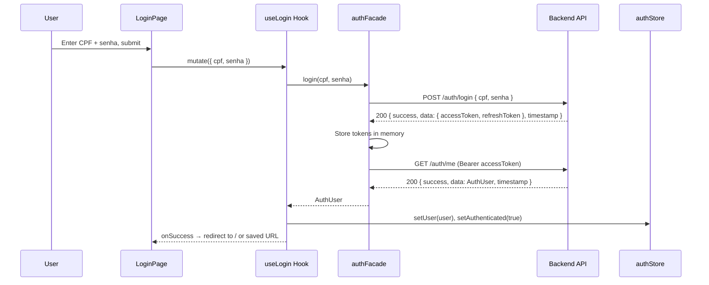
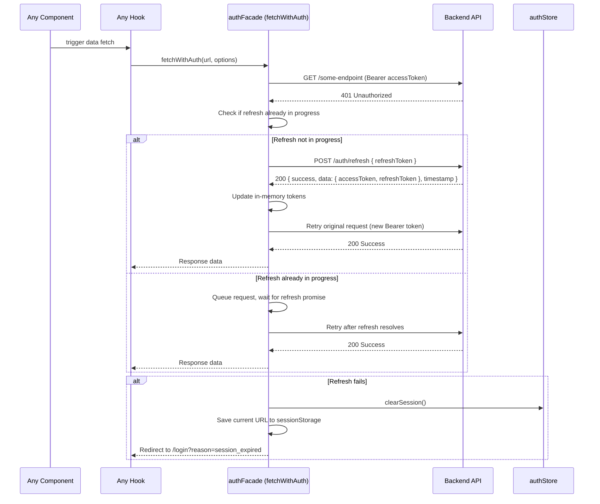
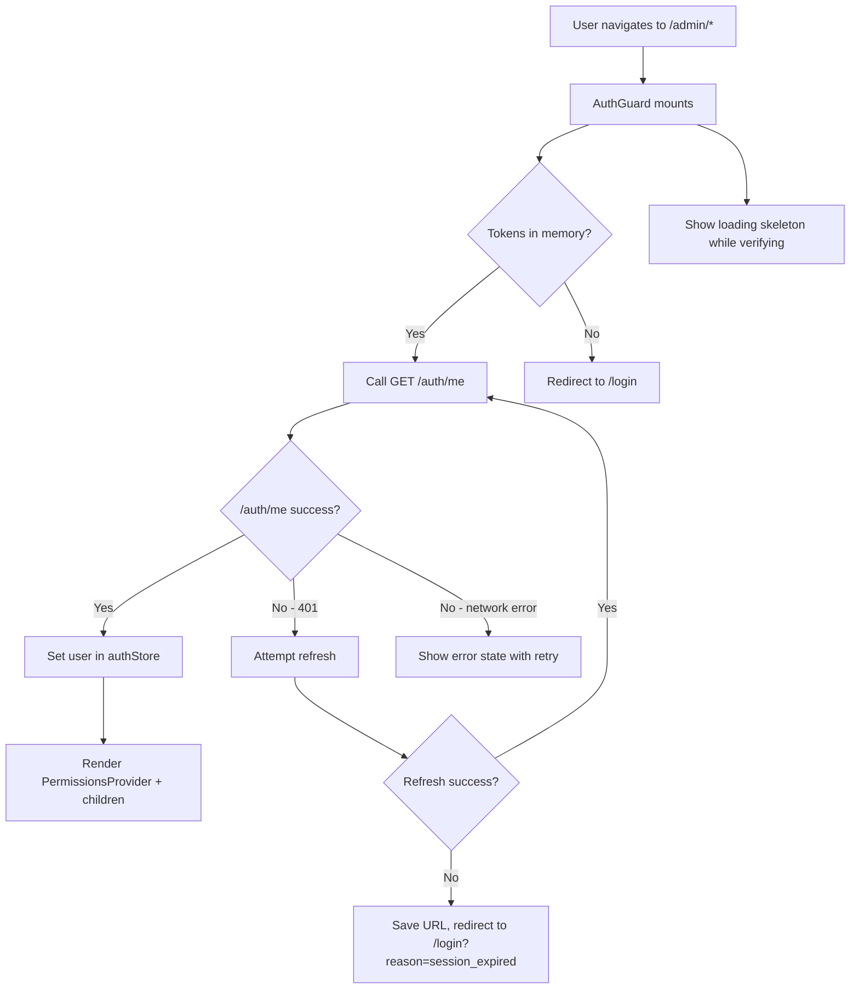
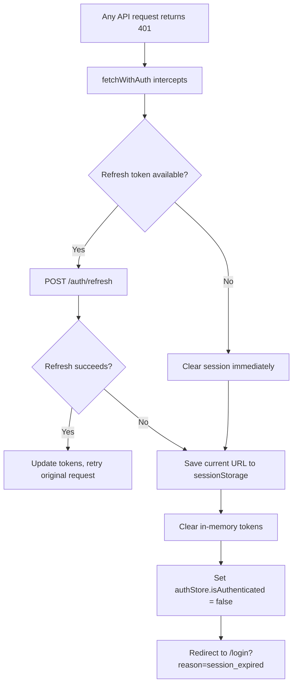

# Design Document — Authentication

## Overview

This design implements the full authentication lifecycle for GOVMOBI-ADMIN: login via CPF + password, in-memory JWT token management with automatic 401 → refresh → retry, session state via Zustand, protected route guards, self-registration with admin activation, and logout. The feature follows the project's mandatory Facade → Hook → Component data flow, integrates with the existing `handleEnvelopedResponse` utility for API envelope unwrapping, and uses MSW v2 for development/test mocking.

### Key Design Decisions

1. **In-memory token storage**: Access and refresh tokens are held in module-scoped variables inside `authFacade.ts`. This avoids XSS exposure via `localStorage`/`sessionStorage` while keeping the implementation simple. The trade-off is that tokens are lost on full page refresh — mitigated by the Auth Guard calling `/auth/me` on mount to restore the session.

2. **Interceptor-style refresh**: Rather than a global fetch wrapper, the facade implements a `fetchWithAuth` internal helper that attaches the Bearer token and handles 401 → refresh → retry with a shared promise to prevent concurrent refresh calls. This keeps the interceptor logic co-located with the token state.

3. **Zustand for session, TanStack Query for data**: The `authStore` holds synchronous session state (`user`, `isAuthenticated`, `redirectUrl`). TanStack Query hooks (`useLogin`, `useCurrentUser`, etc.) handle async API interactions. This follows the project's two-layer state model (ADR-003).

4. **CPF as login identifier**: The backend uses CPF (11-digit Brazilian taxpayer ID) instead of email. The facade sends `{ cpf, senha }` to `/auth/login`. A `formatCpf` / `unformatCpf` utility handles the XXX.XXX.XXX-XX mask.

5. **Auth Guard as client component**: The `(admin)/layout.tsx` wraps children with an `AuthGuard` client component that calls `useCurrentUser` on mount. While verifying, it renders a full-page skeleton. On failure, it redirects to `/login`.

### File Structure

```
src/
  models/
    Auth.ts                          ← AuthUser, TokenPair, LoginInput, RegisterInput
  types/
    auth.ts                          ← Auth-specific API types (re-exports from models)
  facades/
    authFacade.ts                    ← All /auth/* API calls + in-memory token state
  stores/
    authStore.ts                     ← Zustand session store
  hooks/
    auth/
      usePermissions.ts              ← (existing)
      useLogin.ts                    ← useMutation → authFacade.login
      useCurrentUser.ts              ← useQuery → authFacade.me
      useLogout.ts                   ← useMutation → authFacade.logout
      useRegister.ts                 ← useMutation → authFacade.register
      useActivateServidor.ts         ← useMutation → authFacade.activate
  lib/
    cpfUtils.ts                      ← formatCpf, unformatCpf, validateCpf
    phoneUtils.ts                    ← formatPhone, unformatPhone
  components/
    organisms/
      AuthGuard.tsx                  ← Session verification wrapper
      LoginForm.tsx                  ← Login form organism
      RegisterForm.tsx               ← Registration form organism
  app/
    (auth)/
      layout.tsx                     ← Minimal layout (no admin shell)
      login/
        page.tsx                     ← Login page
      register/
        page.tsx                     ← Registration page
  msw/
    authHandlers.ts                  ← MSW handlers for all /auth/* endpoints
  i18n/
    locales/
      pt-BR/
        auth.json                    ← Auth namespace translations
      en/
        auth.json                    ← Auth namespace translations
```

## Architecture

### Authentication Flow



### Token Refresh Flow



### Route Guard Flow



## Components and Interfaces

### authFacade (src/facades/authFacade.ts)

The facade manages all `/auth/*` API calls and holds the in-memory token state. It exposes 6 public methods and one internal helper (`fetchWithAuth`) used by other facades for authenticated requests.

```typescript
// Module-scoped token state (never exported directly)
let accessToken: string | null = null;
let refreshToken: string | null = null;
let refreshPromise: Promise<TokenPair> | null = null;

const BASE_URL = process.env.NEXT_PUBLIC_API_URL ?? "http://172.19.2.116:3000";

export const authFacade = {
  /** POST /auth/login — returns TokenPair, stores tokens in memory */
  login(cpf: string, senha: string): Promise<AuthUser>;

  /** GET /auth/me — returns authenticated user profile */
  me(): Promise<AuthUser>;

  /** POST /auth/refresh — refreshes token pair, updates in-memory state */
  refresh(): Promise<TokenPair>;

  /** POST /auth/logout — clears in-memory tokens */
  logout(): Promise<void>;

  /** POST /auth/register — self-registration for new servidores */
  register(payload: RegisterInput): Promise<Servidor>;

  /** POST /auth/activate/{id} — admin activates a pending servidor */
  activate(id: string): Promise<Servidor>;
};

/**
 * Authenticated fetch wrapper used by all facades for protected endpoints.
 * Attaches Bearer token, handles 401 → refresh → retry with request queuing.
 */
export async function fetchWithAuth(
  url: string,
  options?: RequestInit
): Promise<Response>;
```

**Design notes:**
- `login()` calls POST `/auth/login`, stores the returned tokens, then immediately calls `me()` to return the full `AuthUser`. This means the hook receives the user object directly.
- `fetchWithAuth` is exported so other facades (e.g., `servidoresFacade`, `runsFacade`) can use it for authenticated requests. It handles the 401 → refresh → retry cycle with a shared `refreshPromise` to prevent concurrent refresh calls.
- `refresh()` uses a mutex pattern: if `refreshPromise` is already set, subsequent callers await the same promise instead of issuing duplicate refresh requests.

### authStore (src/stores/authStore.ts)

```typescript
interface AuthState {
  user: AuthUser | null;
  isAuthenticated: boolean;
  isHydrated: boolean;          // true after first /auth/me attempt completes
  redirectUrl: string | null;   // saved URL for post-login redirect
}

interface AuthActions {
  setUser: (user: AuthUser) => void;
  setAuthenticated: (value: boolean) => void;
  setHydrated: (value: boolean) => void;
  setRedirectUrl: (url: string | null) => void;
  clearSession: () => void;     // resets user, isAuthenticated, clears tokens
}

export const useAuthStore = create<AuthState & AuthActions>((set) => ({
  user: null,
  isAuthenticated: false,
  isHydrated: false,
  redirectUrl: null,
  setUser: (user) => set({ user, isAuthenticated: true }),
  setAuthenticated: (isAuthenticated) => set({ isAuthenticated }),
  setHydrated: (isHydrated) => set({ isHydrated }),
  setRedirectUrl: (redirectUrl) => set({ redirectUrl }),
  clearSession: () => set({ user: null, isAuthenticated: false }),
}));
```

### Auth Hooks

| Hook | Type | Facade Method | Key Behavior |
|------|------|---------------|--------------|
| `useLogin` | `useMutation` | `authFacade.login` | On success: sets user in authStore, redirects to saved URL or `/` |
| `useCurrentUser` | `useQuery` | `authFacade.me` | Query key: `["auth", "me"]`. Enabled only when tokens exist. Used by AuthGuard. |
| `useLogout` | `useMutation` | `authFacade.logout` | On success: clears authStore, clears QueryClient cache, redirects to `/login` |
| `useRegister` | `useMutation` | `authFacade.register` | Returns `mutate`, `isPending`, `isError`, `error` for form handling |
| `useActivateServidor` | `useMutation` | `authFacade.activate` | On success: invalidates `["servidores"]` query cache, shows success toast |

### AuthGuard (src/components/organisms/AuthGuard.tsx)

```typescript
interface AuthGuardProps {
  children: ReactNode;
}
```

**Behavior:**
1. On mount, calls `useCurrentUser` to verify the session via `/auth/me`.
2. While loading (`isLoading`): renders a full-page skeleton with `aria-busy="true"`.
3. On success: stores user in `authStore`, renders `<PermissionsProvider role={user.role}>` wrapping `children`.
4. On auth failure (401 after refresh fails): saves current URL to `sessionStorage`, redirects to `/login?reason=session_expired`.
5. On network error: renders an error state with a retry button.

### LoginForm (src/components/organisms/LoginForm.tsx)

**Component hierarchy:**
```
LoginForm (organism)
├── Input (atom) — CPF field with mask, autocomplete="username"
├── Input (atom) — Password field, autocomplete="current-password", type="password"
├── Button (atom) — Submit, isLoading during mutation
├── Alert (inline) — API error message (role="alert")
└── Link — Navigate to /register
```

**Props:** None (self-contained form with internal state).

**Behavior:**
- Client-side validation: CPF format (11 digits after unmasking), non-empty password.
- On submit: calls `useLogin.mutate({ cpf: unformatCpf(cpf), senha })`.
- Error display: inline validation errors per field, API error below the form.
- CPF mask applied via `formatCpf` on input change.
- All strings from `auth` i18n namespace.
- `data-testid` attributes: `input-cpf`, `input-password`, `button-login`, `error-message`.

### RegisterForm (src/components/organisms/RegisterForm.tsx)

**Component hierarchy:**
```
RegisterForm (organism)
├── Input (atom) — nome (full name)
├── Input (atom) — CPF with mask
├── Input (atom) — email
├── Input (atom) — telefone with phone mask
├── Select — cargoId (populated from cargos query)
├── Select — lotacaoId (populated from lotações query)
├── Input (atom) — senha (password), type="password"
├── Input (atom) — confirmSenha (password confirmation), type="password"
├── Button (atom) — Submit, isLoading during mutation
├── Alert (inline) — API error / success message
└── Link — Navigate to /login
```

**Validation rules:**
- `nome`: required, non-empty
- `cpf`: required, 11 digits after unmasking
- `email`: required, valid email format
- `telefone`: optional
- `cargoId`: required
- `lotacaoId`: required
- `senha`: required, minimum 8 characters
- `confirmSenha`: required, must match `senha`

### CPF Utility (src/lib/cpfUtils.ts)

```typescript
/** Applies XXX.XXX.XXX-XX mask to a raw digit string */
export function formatCpf(value: string): string;

/** Strips mask characters, returning only digits */
export function unformatCpf(value: string): string;

/** Validates CPF has exactly 11 digits (after unformatting) */
export function isValidCpfFormat(value: string): boolean;
```

### Phone Utility (src/lib/phoneUtils.ts)

```typescript
/** Applies (XX) XXXXX-XXXX or (XX) XXXX-XXXX mask */
export function formatPhone(value: string): string;

/** Strips mask characters, returning only digits */
export function unformatPhone(value: string): string;
```

## Data Models

### AuthUser (src/models/Auth.ts)

```typescript
import type { Permission } from "@/models/Permission";

/**
 * Authenticated user profile returned by GET /auth/me.
 */
export interface AuthUser {
  id: string;
  nome: string;
  cpf: string;
  email: string;
  role: UserRole;
  permissions: Permission[];
}
```

### TokenPair

```typescript
/**
 * JWT token pair returned by login and refresh endpoints.
 */
export interface TokenPair {
  accessToken: string;
  refreshToken: string;
}
```

### LoginInput

```typescript
/**
 * Payload for POST /auth/login.
 */
export interface LoginInput {
  cpf: string;    // 11 unformatted digits
  senha: string;
}
```

### RegisterInput

```typescript
/**
 * Payload for POST /auth/register.
 */
export interface RegisterInput {
  nome: string;
  cpf: string;       // 11 unformatted digits
  email: string;
  telefone: string;
  cargoId: string;
  lotacaoId: string;
  senha: string;
}
```

### Auth Query Keys

```typescript
export const authKeys = {
  all: ["auth"] as const,
  me: () => ["auth", "me"] as const,
};
```


## Correctness Properties

*A property is a characteristic or behavior that should hold true across all valid executions of a system — essentially, a formal statement about what the system should do. Properties serve as the bridge between human-readable specifications and machine-verifiable correctness guarantees.*

### Property 1: CPF format round-trip

*For any* string of exactly 11 digits, applying `formatCpf` to produce the masked string and then applying `unformatCpf` to strip the mask SHALL return the original 11-digit string unchanged.

**Validates: Requirements 1.3, 2.3**

### Property 2: Phone format round-trip

*For any* string of 10 or 11 digits, applying `formatPhone` to produce the masked string and then applying `unformatPhone` to strip the mask SHALL return the original digit string unchanged.

**Validates: Requirements 10.2**

### Property 3: Bearer token attachment

*For any* URL and request options passed to `fetchWithAuth` when an access token is stored in memory, the outgoing request SHALL include an `Authorization` header with the value `Bearer <accessToken>`.

**Validates: Requirements 4.4, 13.4**

### Property 4: 401 triggers refresh then retry

*For any* authenticated request made via `fetchWithAuth` that receives a 401 response, the system SHALL attempt a token refresh via POST `/auth/refresh` and, if the refresh succeeds, retry the original request exactly once with the new access token.

**Validates: Requirements 6.1, 6.2**

### Property 5: Concurrent refresh deduplication

*For any* number of concurrent authenticated requests that simultaneously receive 401 responses, the system SHALL issue exactly one POST `/auth/refresh` call and resolve all queued requests after the single refresh completes.

**Validates: Requirements 6.4**

### Property 6: Network error produces typed ApiError

*For any* auth facade method (`login`, `me`, `refresh`, `logout`, `register`, `activate`) called when the network is unavailable, the method SHALL throw an `ApiError` with `code` equal to `"NETWORK_ERROR"`.

**Validates: Requirements 13.5**

### Property 7: Password confirmation validation

*For any* two randomly generated strings, the registration form validation SHALL reject the submission when the password and confirmation fields differ, and SHALL accept the submission (for this field pair) when they are identical.

**Validates: Requirements 11.5**

### Property 8: API envelope unwrapping preserves data

*For any* valid data object of type `T`, a Response containing `{ success: true, data: T, timestamp: <any ISO string> }` passed to `handleEnvelopedResponse<T>` SHALL return an object deeply equal to the original `T`.

**Validates: Requirements 3.2, 13.2**

## Error Handling

### Error Handling Strategy by Layer

| Layer | Error Type | Handling |
|-------|-----------|----------|
| **authFacade** | Network failure | Throw `ApiError(0, "NETWORK_ERROR", "Network request failed")` |
| **authFacade** | HTTP 4xx/5xx | Parse response body via `handleEnvelopedResponse`, throw `ApiError(status, code, message)` |
| **authFacade** | 401 on authenticated request | Attempt refresh → retry. If refresh fails, clear session and trigger redirect. |
| **useLogin hook** | `ApiError` from facade | Expose via `isError` and `error`. Component maps error codes to i18n messages. |
| **useCurrentUser hook** | `ApiError` from facade | Expose via `isError`. AuthGuard handles redirect or error state. |
| **useRegister hook** | `ApiError` with `field` | Expose via `error`. Component maps `error.field` to inline form errors. |
| **LoginForm** | Validation errors | Inline errors below each field with `role="alert"`. Prevent submission. |
| **LoginForm** | API 401 | Show generic "invalid credentials" message (no field-specific hint). |
| **LoginForm** | API 429 | Show "too many attempts" message with wait suggestion. |
| **LoginForm** | API 500 / network | Show generic error with retry suggestion. |
| **RegisterForm** | Validation errors | Inline errors below each field with `role="alert"`. Prevent submission. |
| **RegisterForm** | API 409 | Show "CPF already registered" inline error on CPF field. |
| **RegisterForm** | API 422 | Map `error.field` to corresponding form field inline error. |
| **AuthGuard** | Auth failure | Redirect to `/login` (or `/login?reason=session_expired` if refresh failed). |
| **AuthGuard** | Network error | Show full-page error state with retry button. |

### Error Code to i18n Key Mapping

```typescript
const errorMessageKeys: Record<string, string> = {
  UNAUTHORIZED: "auth:errors.invalidCredentials",
  RATE_LIMITED: "auth:errors.tooManyAttempts",
  CONFLICT: "auth:errors.cpfAlreadyRegistered",
  VALIDATION_ERROR: "auth:errors.validationFailed",
  NETWORK_ERROR: "auth:errors.networkError",
  SERVER_ERROR: "auth:errors.serverError",
  FORBIDDEN: "auth:errors.forbidden",
  NOT_FOUND: "auth:errors.notFound",
};
```

### Session Expiry Error Flow



## Testing Strategy

### Testing Approach

This feature uses a **dual testing approach**:

1. **Property-based tests** (via `fast-check` with Vitest): Verify universal properties across many generated inputs. Each property test runs a minimum of 100 iterations and references its design document property.
2. **Example-based unit tests** (via Vitest + Testing Library + MSW): Verify specific scenarios, edge cases, error conditions, and UI rendering.

### Property-Based Testing Configuration

- **Library**: `fast-check` (TypeScript-native, integrates with Vitest)
- **Minimum iterations**: 100 per property
- **Tag format**: `Feature: authentication, Property {number}: {property_text}`

### Test Plan by Layer

#### 1. Utility Tests (src/lib/__tests__/)

| Test | Type | Properties Covered |
|------|------|--------------------|
| `cpfUtils.test.ts` | Property + Example | Property 1 (round-trip), edge cases (empty string, partial digits, non-digit chars) |
| `phoneUtils.test.ts` | Property + Example | Property 2 (round-trip), edge cases (empty string, partial digits) |

#### 2. Facade Tests (src/facades/__tests__/authFacade.test.ts)

| Test | Type | Properties Covered |
|------|------|--------------------|
| Bearer token attachment | Property | Property 3 |
| 401 → refresh → retry | Property | Property 4 |
| Concurrent refresh deduplication | Property | Property 5 |
| Network error handling | Property | Property 6 |
| Envelope unwrapping | Property | Property 8 |
| Login success flow | Example | Req 3.1, 3.2 |
| Login 401 error | Example | Req 3.3 |
| Login 429 error | Example | Req 3.4 |
| Logout clears tokens | Example | Req 7.2 |
| Register success | Example | Req 10.4 |
| Register 409 conflict | Example | Req 10.6 |
| Activate success | Example | Req 12.2 |
| Activate 404 | Example | Req 12.4 |

#### 3. Store Tests (src/stores/__tests__/authStore.test.ts)

| Test | Type | Coverage |
|------|------|----------|
| setUser sets user and isAuthenticated | Example | Req 5.2, 5.3 |
| clearSession resets all state | Example | Req 7.3 |
| setRedirectUrl stores URL | Example | Req 8.1 |

#### 4. Hook Tests (src/hooks/auth/__tests__/)

| Test | Type | Coverage |
|------|------|----------|
| useLogin calls facade and updates store | Integration | Req 14.1 |
| useCurrentUser fetches user profile | Integration | Req 14.2 |
| useLogout clears cache and store | Integration | Req 14.3 |
| useRegister calls facade | Integration | Req 14.4 |
| useActivateServidor invalidates cache | Integration | Req 14.5 |

#### 5. Component Tests

| Test File | Type | Coverage |
|-----------|------|----------|
| `LoginForm.test.tsx` | Example | Req 1.1–1.7, 2.1–2.5, 3.3–3.6, 15.1–15.4, 16.1 |
| `RegisterForm.test.tsx` | Example + Property 7 | Req 10.1–10.10, 11.1–11.7, 16.3 |
| `AuthGuard.test.tsx` | Example | Req 9.1–9.5, 5.5 |

#### 6. MSW Handler Tests (src/msw/__tests__/authHandlers.test.ts)

| Test | Type | Coverage |
|------|------|----------|
| POST /auth/login returns envelope | Integration | Req 17.1, 17.7 |
| GET /auth/me returns user profile | Integration | Req 17.2 |
| POST /auth/refresh returns new tokens | Integration | Req 17.3 |
| POST /auth/logout returns 204 | Integration | Req 17.4 |
| POST /auth/register returns 201 | Integration | Req 17.5 |
| POST /auth/activate/{id} returns 200 | Integration | Req 17.6 |

### MSW Handlers (src/msw/authHandlers.ts)

The auth MSW handlers simulate all 6 auth endpoints with realistic behavior:

```typescript
// Handler summary
export const authHandlers = [
  // POST /auth/login — 200 with TokenPair on valid credentials, 401 on invalid
  http.post(`${BASE_URL}/auth/login`, async ({ request }) => { ... }),

  // GET /auth/me — 200 with AuthUser when authenticated
  http.get(`${BASE_URL}/auth/me`, async ({ request }) => { ... }),

  // POST /auth/refresh — 200 with new TokenPair
  http.post(`${BASE_URL}/auth/refresh`, async () => { ... }),

  // POST /auth/logout — 204 No Content
  http.post(`${BASE_URL}/auth/logout`, async () => { ... }),

  // POST /auth/register — 201 on success, 409 on duplicate CPF
  http.post(`${BASE_URL}/auth/register`, async ({ request }) => { ... }),

  // POST /auth/activate/:id — 200 on success, 404 on invalid ID
  http.post(`${BASE_URL}/auth/activate/:id`, async ({ params }) => { ... }),
];
```

All success responses are wrapped in the `{ success: true, data: T, timestamp: string }` envelope. Handlers include 200–500ms simulated latency via `delay()`.

### Coverage Targets

| Layer | Target |
|-------|--------|
| `src/lib/cpfUtils.ts` | 100% statements |
| `src/lib/phoneUtils.ts` | 100% statements |
| `src/facades/authFacade.ts` | 95% statements |
| `src/stores/authStore.ts` | 100% statements |
| `src/hooks/auth/*.ts` | 90% branches |
| `src/components/organisms/LoginForm.tsx` | 90% statements |
| `src/components/organisms/RegisterForm.tsx` | 90% statements |
| `src/components/organisms/AuthGuard.tsx` | 90% statements |
