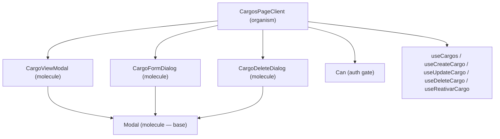

# Design Document

## Overview

This design standardizes the Cargos page UI to match the established Motoristas/Lotações pattern. The changes are purely presentational and behavioral — no API contract changes are required. The work touches four files directly (`CargosPageClient`, `CargoFormDialog`, `CargoDeleteDialog`, and both locale files) and adds two new files (`CargoViewModal` and the updated locale entries).

The reference implementation is `LotacoesPageClient` + `LotacaoViewModal` + `LotacaoFormDialog` + `LotacaoDeleteDialog`, which already follow the target pattern.

---

## Architecture

The feature operates entirely within the client-side React layer. No new hooks, API routes, or server components are needed.



All three dialog/modal components delegate their overlay, header, keyboard handling, body scroll lock, and footer layout to the shared `Modal` base component.

---

## Components and Interfaces

### CargosPageClient

**File:** `src/components/organisms/CargosPageClient.tsx`

New state added:
- `search: string` — controlled value for the search input
- `viewTarget: Cargo | undefined` — cargo currently open in the view modal

New behavior:
- Two-stage filtering: `filterByAtivo` → substring match on `nome`
- Toolbar restructured to match `LotacoesPageClient`: search input (left, `flex-1`) + vertical divider + filter pills (right)
- Table container updated to `rounded-xl border border-neutral-200 bg-white shadow-sm` with `data-testid="cargos-table"`
- `CargoRow` sub-component updated to use icon buttons (inline SVG) instead of `<Button>` text buttons
- View icon button added (no permission gate); Edit/Desativar/Reativar retain existing `Can` gates

**Updated `CargoRow` props:**
```ts
interface CargoRowProps {
  cargo: Cargo;
  onView: (cargo: Cargo) => void;   // new
  onEdit: (cargo: Cargo) => void;
  onDelete: (cargo: Cargo) => void;
}
```

### CargoViewModal

**File:** `src/components/molecules/CargoViewModal.tsx` *(new)*

```ts
export interface CargoViewModalProps {
  open: boolean;
  onClose: () => void;
  cargo: Cargo | undefined;
  "data-testid"?: string;
}
```

Renders via `<Modal maxWidth="max-w-4xl" title={cargo.nome} ...>`. Returns `null` when `cargo` is `undefined`. Internal layout mirrors `LotacaoViewModal`:

- Status badge row (active/inactive ring badge + optional "Desativado em" badge)
- "Dados Básicos" section: `nome`, `pesoPrioridade`
- "Identificação do registro" section: `id`
- "Auditoria" section: `createdAt`, `updatedAt`, `deletedAt` (displays "—" when null)

### CargoFormDialog

**File:** `src/components/molecules/CargoFormDialog.tsx` *(updated)*

Replaces the hand-rolled overlay/section with `<Modal maxWidth="max-w-4xl">`. The form body uses a 2-column grid (`sm:grid-cols-2`) for the `nome` and `pesoPrioridade` inputs. Cancel/Submit buttons move to the `footer` prop. All existing validation and mutation logic is preserved unchanged.

### CargoDeleteDialog

**File:** `src/components/molecules/CargoDeleteDialog.tsx` *(updated)*

Replaces the hand-rolled overlay/section with `<Modal title={t("actions.delete")}>` (default `max-w-lg`). Confirmation message and reversibility note become the `children`. Cancel/Confirm buttons move to the `footer` prop. Mutation logic is preserved unchanged.

### Locale Files

**Files:** `src/i18n/locales/pt-BR/cargos.json`, `src/i18n/locales/en/cargos.json`

Add `"view"` key under `"actions"`:
- pt-BR: `"view": "Visualizar"`
- en: `"view": "View"`

---

## Data Models

No new data models. The existing `Cargo` interface is used as-is:

```ts
interface Cargo {
  id: string;
  nome: string;
  pesoPrioridade: number;
  ativo: boolean;
  createdAt: string;
  updatedAt: string;
  deletedAt: string | null;
}
```

The filtering pipeline in `CargosPageClient`:

```
data (Cargo[])
  → filterByAtivo(data, filter)          // AtivoFilter: "all" | "active" | "inactive"
  → .filter(c => c.nome.toLowerCase().includes(search.trim().toLowerCase()))
  → filtered (Cargo[])
```

Both stages are wrapped in `useMemo` — the status filter in one memo, the search filter in a second dependent memo — matching the `LotacoesPageClient` pattern exactly.

---

## Correctness Properties

*A property is a characteristic or behavior that should hold true across all valid executions of a system — essentially, a formal statement about what the system should do. Properties serve as the bridge between human-readable specifications and machine-verifiable correctness guarantees.*

### Property 1: Search filter only returns matching rows

*For any* list of cargos and any non-empty search term, every cargo in the filtered result must have a `nome` that contains the search term as a case-insensitive substring.

**Validates: Requirements 3.2**

### Property 2: Search and status filters compose correctly

*For any* list of cargos, any `AtivoFilter` value, and any search term, every cargo in the doubly-filtered result must satisfy both the `ativo` condition and the `nome` substring condition simultaneously.

**Validates: Requirements 3.5**

### Property 3: CargoViewModal title matches cargo nome

*For any* `Cargo` record with any `nome` value, when `CargoViewModal` is rendered with `open=true`, the modal title displayed must equal `cargo.nome`.

**Validates: Requirements 2.4**

---

## Error Handling

| Scenario | Handling |
|---|---|
| API error on load | `ErrorState` component with retry button (existing behavior, unchanged) |
| HTTP 409 on create/edit | Inline error on `nome` field; modal stays open (existing behavior, preserved) |
| Reativar mutation pending | Reativar icon button disabled with `disabled` attribute (existing behavior, preserved) |
| `cargo` prop is `undefined` in `CargoViewModal` | Component returns `null` immediately |
| `deletedAt` is `null` in `CargoViewModal` | "Excluído em" field displays "—" |
| Invalid ISO date string in `CargoViewModal` | `safeFormatDate` catches the error and returns the raw string |

---

## Testing Strategy

### Unit / Example Tests

Focus on specific behaviors and structural checks:

- `CargoViewModal` renders `null` when `cargo` is `undefined`
- `CargoViewModal` displays `cargo.nome` as the modal title
- `CargoViewModal` shows "—" for `deletedAt` when it is `null`
- `CargoViewModal` shows the "Desativado em" badge when `deletedAt` is set
- `CargosPageClient` renders the search input with correct `data-testid`, `aria-label`, and `placeholder`
- `CargosPageClient` shows the empty state when the search term matches no cargos
- `CargosPageClient` renders the Desativar button (not Reativar) for `ativo=true` rows
- `CargosPageClient` renders the Reativar button (not Desativar) for `ativo=false` rows
- `CargoFormDialog` displays inline 409 error on the `nome` field without closing
- `CargoDeleteDialog` calls `onClose` after successful deletion

### Property-Based Tests

Uses a property-based testing library (e.g., `fast-check`) with a minimum of 100 iterations per property.

**Property 1 — Search filter only returns matching rows**
```
// Feature: cargos-ui-enhancement, Property 1: search filter only returns matching rows
fc.assert(fc.property(
  fc.array(arbitraryCargo()),
  fc.string({ minLength: 1 }),
  (cargos, term) => {
    const result = cargos.filter(c =>
      c.nome.toLowerCase().includes(term.trim().toLowerCase())
    );
    return result.every(c =>
      c.nome.toLowerCase().includes(term.trim().toLowerCase())
    );
  }
), { numRuns: 100 });
```

**Property 2 — Search and status filters compose correctly**
```
// Feature: cargos-ui-enhancement, Property 2: search and status filters compose correctly
fc.assert(fc.property(
  fc.array(arbitraryCargo()),
  fc.constantFrom("all", "active", "inactive"),
  fc.string(),
  (cargos, filter, term) => {
    const byStatus = filterByAtivo(cargos, filter);
    const bySearch = term.trim()
      ? byStatus.filter(c => c.nome.toLowerCase().includes(term.trim().toLowerCase()))
      : byStatus;
    return bySearch.every(c => {
      const statusOk = filter === "all" || (filter === "active" ? c.ativo : !c.ativo);
      const searchOk = !term.trim() || c.nome.toLowerCase().includes(term.trim().toLowerCase());
      return statusOk && searchOk;
    });
  }
), { numRuns: 100 });
```

**Property 3 — CargoViewModal title matches cargo nome**
```
// Feature: cargos-ui-enhancement, Property 3: CargoViewModal title matches cargo nome
fc.assert(fc.property(
  arbitraryCargo(),
  (cargo) => {
    const { getByText } = render(
      <CargoViewModal open={true} onClose={() => {}} cargo={cargo} />
    );
    return !!getByText(cargo.nome);
  }
), { numRuns: 100 });
```
