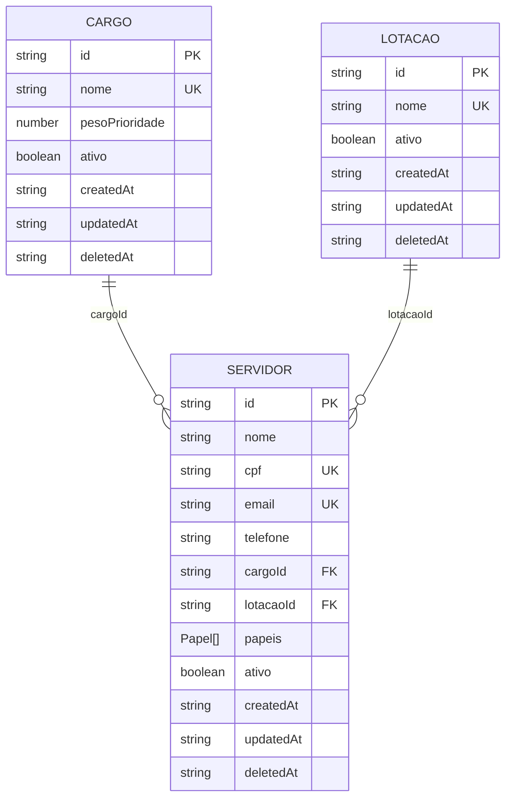
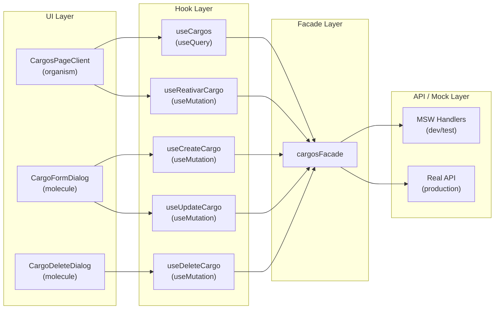
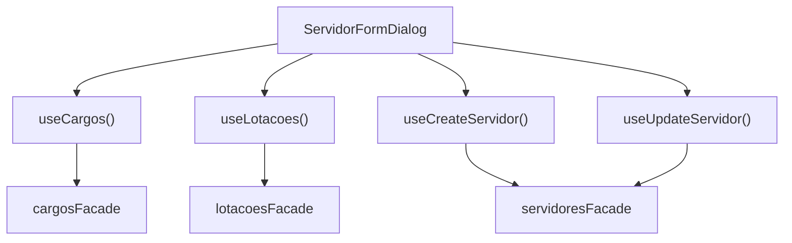

# Design Document — Identity Management

## Overview

The Identity Management feature provides full CRUD lifecycle management for three interconnected domains in GOVMOBI-ADMIN: **Cargos** (job positions), **Lotações** (organizational units), and **Servidores** (public servants). Each domain supports listing, creation, editing, soft-delete (deactivation), and reactivation through a consistent layered architecture.

All three domains share a uniform pattern:
- **Data flow:** UI Component → Custom Hook → Facade → API (via MSW in dev/test, real backend in production)
- **API envelope:** Every backend response wraps data in `{ success: boolean, data: T, timestamp: string }`, unwrapped by facades using `handleApiResponse<ApiEnvelope<T>>`
- **State management:** TanStack Query for server state, Zustand for UI-only state (filters, modals)
- **Permission gating:** `<Can>` component and `usePermissions()` hook enforce RBAC at the UI layer
- **i18n:** All user-visible strings use `react-i18next` with domain-specific namespaces (`cargos`, `lotacoes`, `servidores`)

### Domain Relationships



**Key dependency:** Servidores references both Cargos and Lotações via foreign keys. The Servidor create/edit form must fetch active Cargos and Lotações to populate its select fields. Implementation order: Cargos → Lotações → Servidores.

---

## Architecture

### Layered Data Flow

Each domain follows the project's mandatory unidirectional data flow. The diagram below shows the Cargos domain as a representative example — Lotações and Servidores follow the identical pattern.



### Cross-Domain Dependencies (Servidores)

The Servidores form dialog has a cross-domain dependency: it must fetch active Cargos and Lotações to populate its `cargoId` and `lotacaoId` select fields.



The form filters the fetched lists to show only `ativo: true` entries in the select dropdowns.

### Query Cache Invalidation Strategy

All mutations invalidate the relevant list query on success. Update mutations additionally invalidate the detail query for the affected entity.

| Mutation | Invalidates |
|---|---|
| `useCreate{Domain}` | `{domain}Keys.list()` |
| `useUpdate{Domain}` | `{domain}Keys.list()` + `{domain}Keys.detail(id)` |
| `useDelete{Domain}` | `{domain}Keys.list()` |
| `useReativar{Domain}` | `{domain}Keys.list()` |

---

## Components and Interfaces

### File Structure

All three domains follow the same file organization pattern established by the existing codebase:

```
src/
  models/
    Cargo.ts                              ← Already exists
    Lotacao.ts                            ← Already exists
    Servidor.ts                           ← Already exists
    Permission.ts                         ← Extend with missing permissions
  types/
    cargos.ts                             ← Already exists
    lotacoes.ts                           ← Already exists
    servidores.ts                         ← Already exists
  lib/queryKeys/
    cargosKeys.ts                         ← Already exists
    lotacoesKeys.ts                       ← Already exists
    servidoresKeys.ts                     ← Needs creation
  facades/
    cargosFacade.ts                       ← Already exists
    lotacoesFacade.ts                     ← Already exists
    servidoresFacade.ts                   ← Needs creation
  hooks/
    cargos/
      useCargos.ts                        ← Already exists
      useCreateCargo.ts                   ← Already exists
      useDeleteCargo.ts                   ← Already exists
      useReativarCargo.ts                 ← Already exists
      useUpdateCargo.ts                   ← Needs creation
    lotacoes/
      useLotacoes.ts                      ← Needs creation
      useCreateLotacao.ts                 ← Needs creation
      useUpdateLotacao.ts                 ← Needs creation
      useDeleteLotacao.ts                 ← Needs creation
      useReativarLotacao.ts               ← Needs creation
    servidores/
      useServidores.ts                    ← Needs creation
      useCreateServidor.ts                ← Needs creation
      useUpdateServidor.ts                ← Needs creation
      useDeleteServidor.ts                ← Needs creation
      useReativarServidor.ts              ← Needs creation
  msw/
    cargosHandlers.ts                     ← Already exists
    lotacoesHandlers.ts                   ← Already exists
    servidoresHandlers.ts                 ← Needs creation
  test/fixtures/
    cargos.ts                             ← Already exists
    lotacoes.ts                           ← Already exists
    servidores.ts                         ← Needs creation
  app/(admin)/
    cargos/page.tsx                       ← Already exists
    lotacoes/page.tsx                     ← Already exists
    servidores/page.tsx                   ← Already exists
  components/
    organisms/
      CargosPageClient.tsx                ← Already exists (needs action buttons)
      LotacoesPageClient.tsx              ← Already exists (needs action buttons)
      ServidoresPageClient.tsx            ← Needs creation
    molecules/
      CargoFormDialog.tsx                 ← Needs creation
      CargoDeleteDialog.tsx               ← Needs creation
      LotacaoFormDialog.tsx               ← Already exists (needs review)
      LotacaoDeleteDialog.tsx             ← Already exists (needs review)
      ServidorFormDialog.tsx              ← Already exists (needs review)
      ServidorDeleteDialog.tsx            ← Already exists (needs review)
  i18n/locales/en/
    cargos.json                           ← Needs creation
    lotacoes.json                         ← Needs creation
    servidores.json                       ← Needs creation
```

### Component Hierarchy

#### Cargos Domain

```
CargosPage (Server Component)
└── CargosPageClient (organism, "use client")
    ├── Filter toggle (All / Active / Inactive)
    ├── "New Cargo" button → <Can perform="cargo:create">
    ├── Loading state → skeleton rows
    ├── Error state → <ErrorState onRetry={refetch} />
    ├── Empty state → guidance message
    └── Table
        └── CargoRow (per row)
            ├── Edit button → <Can perform="cargo:edit">
            ├── Deactivate button → <Can perform="cargo:delete"> (active rows)
            └── Reactivate button → <Can perform="cargo:reativar"> (inactive rows)
    ├── CargoFormDialog (molecule) — mode: "create" | "edit"
    └── CargoDeleteDialog (molecule) — confirmation dialog
```

#### Lotações Domain

```
LotacoesPage (Server Component)
└── LotacoesPageClient (organism, "use client")
    ├── Filter toggle (All / Active / Inactive)
    ├── "New Lotação" button → <Can perform="lotacao:create">
    ├── Loading / Error / Empty states
    └── Table
        └── LotacaoRow (per row)
            ├── Edit button → <Can perform="lotacao:edit">
            ├── Deactivate button → <Can perform="lotacao:delete"> (active rows)
            └── Reactivate button → <Can perform="lotacao:reativar"> (inactive rows)
    ├── LotacaoFormDialog (molecule) — mode: "create" | "edit"
    └── LotacaoDeleteDialog (molecule) — confirmation dialog
```

#### Servidores Domain

```
ServidoresPage (Server Component)
└── ServidoresPageClient (organism, "use client")
    ├── Filter toggle (All / Active / Inactive)
    ├── "New Servidor" button → <Can perform="servidor:create">
    ├── Loading / Error / Empty states
    └── Table
        └── ServidorRow (per row)
            ├── CPF formatted as XXX.XXX.XXX-XX (display only)
            ├── Papéis rendered as Badge components
            ├── Edit button → <Can perform="servidor:edit">
            ├── Deactivate button → <Can perform="servidor:delete"> (active rows)
            └── Reactivate button → <Can perform="servidor:reativar"> (inactive rows)
    ├── ServidorFormDialog (molecule) — mode: "create" | "edit"
    │   ├── cargoId select → populated from useCargos() filtered to ativo: true
    │   ├── lotacaoId select → populated from useLotacoes() filtered to ativo: true
    │   ├── papéis multi-select → USUARIO, ADMIN, MOTORISTA
    │   └── CPF + email → read-only in edit mode
    └── ServidorDeleteDialog (molecule) — confirmation dialog
```

### Facade Interfaces

All facades follow the established pattern using `handleApiResponse<ApiEnvelope<T>>` to unwrap the API envelope.

**cargosFacade** (already exists):
- `listCargos(): Promise<Cargo[]>`
- `getCargoById(input: GetCargoByIdInput): Promise<Cargo>`
- `createCargo(input: CreateCargoInput): Promise<Cargo>`
- `updateCargo(id: string, input: UpdateCargoInput): Promise<Cargo>`
- `deleteCargo(id: string): Promise<void>`
- `reativarCargo(id: string): Promise<Cargo>`

**lotacoesFacade** (already exists):
- `listLotacoes(): Promise<Lotacao[]>`
- `getLotacaoById(input: GetLotacaoByIdInput): Promise<Lotacao>`
- `createLotacao(input: CreateLotacaoInput): Promise<Lotacao>`
- `updateLotacao(id: string, input: UpdateLotacaoInput): Promise<Lotacao>`
- `deleteLotacao(id: string): Promise<void>`
- `reativarLotacao(id: string): Promise<Lotacao>`

**servidoresFacade** (needs creation):
- `listServidores(): Promise<Servidor[]>`
- `getServidorById(input: GetServidorByIdInput): Promise<Servidor>`
- `createServidor(input: CreateServidorInput): Promise<Servidor>`
- `updateServidor(id: string, input: UpdateServidorInput): Promise<Servidor>`
- `deleteServidor(id: string): Promise<void>`
- `reativarServidor(id: string): Promise<Servidor>`

### Hook Interfaces

Each domain exposes one list query hook and four mutation hooks:

| Hook | Type | Returns |
|---|---|---|
| `use{Domain}s()` | `useQuery` | `{ data, isLoading, isError, refetch }` |
| `useCreate{Domain}()` | `useMutation` | TanStack mutation object |
| `useUpdate{Domain}()` | `useMutation` | TanStack mutation object |
| `useDelete{Domain}()` | `useMutation` | TanStack mutation object |
| `useReativar{Domain}()` | `useMutation` | TanStack mutation object |

### Query Key Factories

```typescript
// cargosKeys (already exists)
export const cargosKeys = {
  list: ()             => ["cargos", "list"] as const,
  detail: (id: string) => ["cargos", "detail", id] as const,
};

// lotacoesKeys (already exists)
export const lotacoesKeys = {
  list: ()             => ["lotacoes", "list"] as const,
  detail: (id: string) => ["lotacoes", "detail", id] as const,
};

// servidoresKeys (needs creation)
export const servidoresKeys = {
  list: ()             => ["servidores", "list"] as const,
  detail: (id: string) => ["servidores", "detail", id] as const,
};
```

### Permission Enum Extensions

The existing `Permission` enum needs the following additions (some already exist):

| Permission | Status |
|---|---|
| `CARGO_VIEW` | ✅ Exists |
| `CARGO_CREATE` | ❌ Missing — add `"cargo:create"` |
| `CARGO_EDIT` | ❌ Missing — add `"cargo:edit"` |
| `CARGO_DELETE` | ❌ Missing — add `"cargo:delete"` |
| `CARGO_REATIVAR` | ❌ Missing — add `"cargo:reativar"` |
| `LOTACAO_VIEW` | ✅ Exists |
| `LOTACAO_CREATE` | ✅ Exists |
| `LOTACAO_EDIT` | ✅ Exists |
| `LOTACAO_DELETE` | ✅ Exists |
| `LOTACAO_REATIVAR` | ❌ Missing — add `"lotacao:reativar"` |
| `SERVIDOR_VIEW` | ✅ Exists |
| `SERVIDOR_CREATE` | ✅ Exists |
| `SERVIDOR_EDIT` | ✅ Exists |
| `SERVIDOR_DELETE` | ✅ Exists |
| `SERVIDOR_REATIVAR` | ✅ Exists |

The `RolePermissionMap` must be updated so that `UserRole.ADMIN` receives all new permissions (it already uses `Object.values(Permission)`, so new enum entries are automatically included).

---

## Data Models

### Cargo (already exists in `src/models/Cargo.ts`)

```typescript
export interface Cargo {
  id: string;              // UUID v7
  nome: string;            // Unique name, max 100 chars
  pesoPrioridade: number;  // 0–100 priority weight
  ativo: boolean;
  createdAt: string;       // ISO 8601
  updatedAt: string;       // ISO 8601
  deletedAt: string | null;
}
```

**Input types** (`src/types/cargos.ts`):
```typescript
interface CreateCargoInput { nome: string; pesoPrioridade: number; }
interface UpdateCargoInput { nome: string; pesoPrioridade: number; }
interface GetCargoByIdInput { id: string; }
```

### Lotação (already exists in `src/models/Lotacao.ts`)

```typescript
export interface Lotacao {
  id: string;              // UUID v7
  nome: string;            // Unique name, max 100 chars
  ativo: boolean;
  createdAt: string;       // ISO 8601
  updatedAt: string;       // ISO 8601
  deletedAt: string | null;
}
```

**Input types** (`src/types/lotacoes.ts`):
```typescript
interface CreateLotacaoInput { nome: string; }
interface UpdateLotacaoInput { nome: string; }
interface GetLotacaoByIdInput { id: string; }
```

### Servidor (already exists in `src/models/Servidor.ts`)

```typescript
export type Papel = "USUARIO" | "ADMIN" | "MOTORISTA";

export interface Servidor {
  id: string;              // UUID v7
  nome: string;
  cpf: string;             // 11 raw digits, formatted only on render
  email: string;
  telefone: string;
  cargoId: string;         // FK → Cargo.id
  lotacaoId: string;       // FK → Lotacao.id
  papeis: Papel[];         // At least one required
  ativo: boolean;
  createdAt: string;       // ISO 8601
  updatedAt: string;       // ISO 8601
  deletedAt: string | null;
}
```

**Input types** (`src/types/servidores.ts`):
```typescript
interface CreateServidorInput {
  nome: string;
  cpf: string;             // 11 digits
  email: string;
  telefone: string;
  cargoId: string;
  lotacaoId: string;
  papeis: Papel[];
}

interface UpdateServidorInput {
  nome?: string;
  telefone?: string;
  cargoId?: string;
  lotacaoId?: string;
  papeis?: Papel[];
}

interface GetServidorByIdInput { id: string; }
```

### API Envelope (shared, already exists in `src/lib/handleApiResponse.ts`)

```typescript
export interface ApiEnvelope<T> {
  success: boolean;
  data: T;
  timestamp: string;
}
```

### CPF Formatting Utility

CPF is stored as 11 raw digits and formatted only for display:

```typescript
// src/lib/formatCpf.ts
export function formatCpf(cpf: string): string {
  return cpf.replace(/(\d{3})(\d{3})(\d{3})(\d{2})/, "$1.$2.$3-$4");
}
```

### Validation Rules

| Field | Domain | Rules |
|---|---|---|
| `nome` | Cargo, Lotação | Required, max 100 chars, unique per domain |
| `pesoPrioridade` | Cargo | Required, integer, min 0, max 100 |
| `nome` | Servidor | Required |
| `cpf` | Servidor | Required, exactly 11 digits, unique, read-only in edit |
| `email` | Servidor | Required, valid email format, unique, read-only in edit |
| `telefone` | Servidor | Required |
| `cargoId` | Servidor | Required, must reference an active Cargo |
| `lotacaoId` | Servidor | Required, must reference an active Lotação |
| `papeis` | Servidor | Required, at least one value from `["USUARIO", "ADMIN", "MOTORISTA"]` |


---

## Correctness Properties

*A property is a characteristic or behavior that should hold true across all valid executions of a system — essentially, a formal statement about what the system should do. Properties serve as the bridge between human-readable specifications and machine-verifiable correctness guarantees.*

### Property 1: Active/Inactive filter partitions entities correctly

*For any* list of entities (Cargo, Lotação, or Servidor) with mixed `ativo` values, applying the "active" filter SHALL return only entities where `ativo === true`, applying the "inactive" filter SHALL return only entities where `ativo === false`, and applying the "all" filter SHALL return the original unmodified list. The union of active-filtered and inactive-filtered results SHALL equal the full list.

**Validates: Requirements 1.5, 6.5, 11.6, 12.3, 12.4**

### Property 2: CPF formatting preserves digits and produces correct pattern

*For any* string of exactly 11 digits, `formatCpf` SHALL produce a string matching the pattern `XXX.XXX.XXX-XX`, and removing all non-digit characters from the formatted output SHALL yield the original 11-digit input string.

**Validates: Requirements 11.2**

### Property 3: Servidor update payload contains only changed fields

*For any* existing Servidor and any set of edits to the mutable fields (nome, telefone, cargoId, lotacaoId, papéis), the update payload sent to the API SHALL contain only the fields whose values differ from the original Servidor data. Fields that remain unchanged SHALL be absent from the payload.

**Validates: Requirements 13.5**

### Property 4: Facade envelope unwrapping returns clean domain data

*For any* valid domain object (Cargo, Lotação, or Servidor) wrapped in the API envelope `{ success: true, data: T, timestamp: string }`, calling the corresponding facade method SHALL return an object deeply equal to the original unwrapped `data` field, with no envelope metadata attached.

**Validates: Requirements 16.1, 16.2, 16.3**

---

## Error Handling

### Error Classification by HTTP Status

All three domains share the same error handling patterns, mapped to user-facing behavior:

| HTTP Status | Meaning | UI Behavior |
|---|---|---|
| `400` | Invalid data (Servidores only: bad CPF, email, or papéis) | Dialog stays open, inline error message |
| `404` | Entity not found (or referenced cargo/lotação not found) | Toast notification, dialog closes |
| `409` | Duplicate name (Cargos/Lotações) or duplicate CPF/email (Servidores) | Dialog stays open, inline error message |
| `5xx` | Server error | Toast with generic error message |
| Network failure | Fetch fails entirely | TanStack Query `isError` state → ErrorState component with retry |

### Error Handling by Layer

| Layer | Responsibility |
|---|---|
| **Facade** | Calls `handleApiResponse()` which throws typed `ApiError` on non-2xx. The `ApiError` class carries `status`, `code`, and `message`. |
| **Hook (mutation)** | `onError` callback inspects `error.status` to determine toast message key. For 409/400, the error is also surfaced to the component via the mutation's `error` state. |
| **Hook (query)** | TanStack Query exposes `isError` and `error` for the component to render error states. |
| **Component** | Renders `<ErrorState onRetry={refetch} />` for query errors. For mutation errors, keeps dialog open and shows inline error or toast depending on status code. |

### Inline Error vs Toast Decision

- **Inline error (dialog stays open):** 400, 409 — the user can correct the input and retry.
- **Toast notification (dialog closes or no dialog):** 404, 5xx — the error is not correctable by the user in the current form.

### Error Message i18n Keys

**Cargos:**
- `cargos:toast.duplicateName` — 409
- `cargos:toast.notFound` — 404
- `common:toast.serverError` — 5xx

**Lotações:**
- `lotacoes:toast.duplicateName` — 409
- `lotacoes:toast.notFound` — 404
- `common:toast.serverError` — 5xx

**Servidores:**
- `servidores:toast.duplicate` — 409 (CPF or email)
- `servidores:toast.invalidData` — 400
- `servidores:toast.dependencyNotFound` — 404 (cargo or lotação)
- `common:toast.serverError` — 5xx

---

## Testing Strategy

### Dual Testing Approach

This feature uses both **example-based unit/integration tests** and **property-based tests** for comprehensive coverage.

- **Unit tests** verify specific UI interactions, permission gating, loading/error/empty states, and error handling flows.
- **Property-based tests** verify universal invariants that hold across all valid inputs: filtering logic, CPF formatting, update payload construction, and envelope unwrapping.

### Property-Based Testing Configuration

- **Library:** [fast-check](https://github.com/dubzzz/fast-check) (the standard PBT library for TypeScript/Vitest)
- **Minimum iterations:** 100 per property test
- **Tag format:** `Feature: identity-management, Property {number}: {property_text}`

Each property test maps to a correctness property from the design document:

| Property | Test File | What It Generates |
|---|---|---|
| Property 1: Filter partitions | `src/lib/__tests__/filterByAtivo.property.test.ts` | Random arrays of `{ ativo: boolean }` objects |
| Property 2: CPF formatting | `src/lib/__tests__/formatCpf.property.test.ts` | Random 11-digit strings |
| Property 3: Update payload diff | `src/hooks/servidores/__tests__/buildUpdatePayload.property.test.ts` | Random Servidor objects and random edits |
| Property 4: Envelope unwrapping | `src/facades/__tests__/envelopeUnwrap.property.test.ts` | Random domain objects wrapped in `ApiEnvelope` |

### Unit Test Coverage Plan

#### Facade Tests (per domain)

| Test | Scenario |
|---|---|
| `list{Domain}` | Returns unwrapped array on 200 |
| `create{Domain}` | Returns unwrapped entity on 201 |
| `create{Domain}` | Throws ApiError on 409 |
| `update{Domain}` | Returns unwrapped entity on 200 |
| `update{Domain}` | Throws ApiError on 404 |
| `update{Domain}` | Throws ApiError on 409 |
| `delete{Domain}` | Succeeds on 200 |
| `delete{Domain}` | Throws ApiError on 404 |
| `reativar{Domain}` | Returns unwrapped entity on 200 |
| `reativar{Domain}` | Throws ApiError on 404 |

#### Hook Tests (per domain)

| Test | Scenario |
|---|---|
| `use{Domain}s` | Returns data on success |
| `use{Domain}s` | Returns isError on failure |
| `useCreate{Domain}` | Invalidates list query on success |
| `useCreate{Domain}` | Shows success toast on success |
| `useCreate{Domain}` | Shows duplicate error toast on 409 |
| `useUpdate{Domain}` | Invalidates list + detail queries on success |
| `useDelete{Domain}` | Invalidates list query on success |
| `useReativar{Domain}` | Invalidates list query on success |

#### Component Tests

| Component | Scenarios |
|---|---|
| `CargosPageClient` | Loading state, error state, empty state, table rendering, filter toggle, permission gates |
| `LotacoesPageClient` | Same as Cargos |
| `ServidoresPageClient` | Same as Cargos + CPF formatting in table, papéis badges |
| `CargoFormDialog` | Create mode, edit mode (pre-populated), validation, 409 inline error |
| `LotacaoFormDialog` | Create mode, edit mode, validation, 409 inline error |
| `ServidorFormDialog` | Create mode, edit mode (CPF/email read-only), cargo/lotação selects show only active, papéis multi-select, 400/404/409 inline errors |
| `CargoDeleteDialog` | Opens, confirms deactivation, cancels |
| `LotacaoDeleteDialog` | Same as Cargo |
| `ServidorDeleteDialog` | Same as Cargo |

### MSW Handler Requirements

Each domain needs MSW handlers for all six endpoints (list, get by ID, create, update, delete, reactivate). Handlers must:

- Return responses in the `{ success, data, timestamp }` envelope format
- Simulate realistic latency (200–500ms) using `delay()`
- Support error scenarios via sentinel values (e.g., `nome === "DUPLICATE_TEST"` → 409, `id === "not-found"` → 404)
- Use fixture data from `src/test/fixtures/`

### Test File Organization

```
src/
  lib/__tests__/
    filterByAtivo.property.test.ts        ← Property 1
    formatCpf.property.test.ts            ← Property 2
  facades/__tests__/
    cargosFacade.test.ts
    lotacoesFacade.test.ts
    servidoresFacade.test.ts
    envelopeUnwrap.property.test.ts       ← Property 4
  hooks/
    cargos/__tests__/
      useCargos.test.ts
      useCreateCargo.test.ts
      useUpdateCargo.test.ts
      useDeleteCargo.test.ts
      useReativarCargo.test.ts
    lotacoes/__tests__/
      useLotacoes.test.ts
      useCreateLotacao.test.ts
      useUpdateLotacao.test.ts
      useDeleteLotacao.test.ts
      useReativarLotacao.test.ts
    servidores/__tests__/
      useServidores.test.ts
      useCreateServidor.test.ts
      useUpdateServidor.test.ts
      useDeleteServidor.test.ts
      useReativarServidor.test.ts
      buildUpdatePayload.property.test.ts ← Property 3
  components/
    organisms/__tests__/
      CargosPageClient.test.tsx
      LotacoesPageClient.test.tsx
      ServidoresPageClient.test.tsx
    molecules/__tests__/
      CargoFormDialog.test.tsx
      CargoDeleteDialog.test.tsx
      LotacaoFormDialog.test.tsx
      LotacaoDeleteDialog.test.tsx
      ServidorFormDialog.test.tsx
      ServidorDeleteDialog.test.tsx
```

### Coverage Targets

| Layer | Target |
|---|---|
| Facades | 95% statements |
| Hooks | 90% branches |
| Organisms | 90% statements |
| Molecules (dialogs) | 90% statements |
| Utility functions (formatCpf, filter) | 100% statements |
