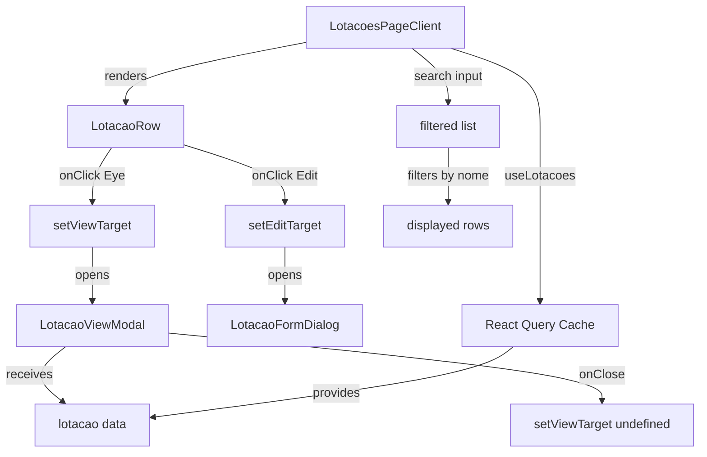

# Design Document: Lotações UI Enhancement

## Overview

This design document specifies the technical implementation for enhancing the Lotações page UI to match the visual pattern established in the Motoristas page. The enhancement focuses on four main areas:

1. **Icon Button Pattern**: Replace text-based action buttons with fixed icon buttons that are always visible
2. **View Modal Component**: Create a new `LotacaoViewModal` component to display complete lotação details
3. **Search Functionality**: Add search input to filter lotações by nome
4. **Form Layout Enhancement**: Update `LotacaoFormDialog` to use a wider modal width for visual consistency

The implementation will ensure visual consistency across the application while maintaining all existing functionality, permissions, and API integrations.

### Design Goals

- **Visual Consistency**: Match the Motoristas page icon button pattern, toolbar layout, and modal structure
- **Accessibility**: Maintain WCAG compliance with proper ARIA labels and keyboard navigation
- **Maintainability**: Reuse existing components (Modal, Button, Badge) and patterns
- **Zero Regression**: Preserve all existing CRUD operations, permissions, and error handling

## Architecture

### Component Hierarchy

```
LotacoesPageClient (existing, modified)
├── Toolbar (modified)
│   ├── Search Input (new)
│   └── Filter Pills (existing)
├── LotacaoRow (existing, modified)
│   ├── Icon Buttons (new pattern)
│   │   ├── View Button (Eye icon)
│   │   ├── Edit Button (Pencil icon)
│   │   ├── Desativar Button (Circle-slash icon)
│   │   └── Reativar Button (Rotate-cw icon)
├── LotacaoFormDialog (existing, modified width)
├── LotacaoDeleteDialog (existing, unchanged)
└── LotacaoViewModal (new component)
```

### State Management

The `LotacoesPageClient` component will manage two additional state variables:

```typescript
const [search, setSearch] = useState("");
const [viewTarget, setViewTarget] = useState<Lotacao | undefined>();
```

This follows the same pattern as the Motoristas page.

### Data Flow



## Components and Interfaces

### 1. LotacaoViewModal (New Component)

**File**: `src/components/molecules/LotacaoViewModal.tsx`

**Purpose**: Display all lotação fields in an organized, read-only modal view.

**Interface**:

```typescript
export interface LotacaoViewModalProps {
  open: boolean;
  onClose: () => void;
  lotacao: Lotacao | undefined;
  "data-testid"?: string;
}
```

**Component Structure**:

The component will follow the `MotoristaViewModal` pattern with these sections:

1. **Header**: Lotação nome as title
2. **Status Badge**: Active/Inactive indicator with colored badge
3. **Dados Básicos**: nome field
4. **Identificação do registro**: id field
5. **Auditoria**: createdAt, updatedAt, deletedAt (formatted timestamps)

**Status Badge Colors**:

```typescript
const STATUS_CLASSES = {
  active: "bg-success/10 text-success ring-1 ring-success/20",
  inactive: "bg-neutral-100 text-neutral-500 ring-1 ring-neutral-200",
};
```

**Timestamp Formatting**:

```typescript
const formatDate = (iso: string) =>
  new Date(iso).toLocaleString("pt-BR", {
    day: "2-digit",
    month: "2-digit",
    year: "numeric",
    hour: "2-digit",
    minute: "2-digit",
    second: "2-digit",
  });
```

**Sub-components**:

The component will reuse the `Section` and `Field` helper components pattern:

```typescript
function Section({ title, children }: { title: string; children: React.ReactNode }) {
  return (
    <div>
      <h3 className="mb-3 text-sm font-semibold text-neutral-900">{title}</h3>
      <div className="rounded-xl border border-neutral-100 bg-white p-5">
        {children}
      </div>
    </div>
  );
}

function Field({ label, value }: { label: string; value: string }) {
  return (
    <div className="flex flex-col gap-1">
      <dt className="text-xs font-semibold text-neutral-900">{label}</dt>
      <dd className="break-all text-sm text-neutral-400">{value || "—"}</dd>
    </div>
  );
}
```

### 2. LotacaoRow (Modified Component)

**File**: `src/components/organisms/LotacoesPageClient.tsx` (LotacaoRow function)

**Changes**:

1. Remove text-based `Button` components
2. Replace with icon-only `button` elements that are always visible
3. Add new `onView` callback prop

**Updated Interface**:

```typescript
interface LotacaoRowProps {
  lotacao: Lotacao;
  onView: (l: Lotacao) => void;      // NEW
  onEdit: (l: Lotacao) => void;
  onDelete: (l: Lotacao) => void;
}
```

**Icon Button Pattern**:

Each icon button will follow this structure:

```typescript
<button
  type="button"
  data-testid={`lotacao-{action}-${lotacao.id}`}
  aria-label={t("actions.{action}")}
  title={t("actions.{action}")}
  onClick={() => onAction(lotacao)}
  className="rounded-md p-1.5 text-neutral-400 transition-colors hover:bg-{color}/10 hover:text-{color} focus-visible:outline-none focus-visible:ring-2 focus-visible:ring-{color}"
>
  <svg className="h-4 w-4" fill="none" stroke="currentColor" strokeWidth={1.75} viewBox="0 0 24 24" aria-hidden="true">
    {/* SVG path */}
  </svg>
</button>
```

**Icon Button Specifications**:

| Action | Icon | Default Color | Hover Color | Permission |
|--------|------|---------------|-------------|------------|
| View | Eye | neutral-400 | neutral-700 | None (always visible) |
| Edit | Pencil | neutral-400 | brand-primary | LOTACAO_EDIT |
| Desativar | Circle-slash | neutral-400 | danger | LOTACAO_DELETE |
| Reativar | Rotate-cw | neutral-400 | success | LOTACAO_REATIVAR |

**SVG Icons**:

```typescript
// Eye icon (view)
<path strokeLinecap="round" strokeLinejoin="round" d="M2.036 12.322a1.012 1.012 0 010-.639C3.423 7.51 7.36 4.5 12 4.5c4.638 0 8.573 3.007 9.963 7.178.07.207.07.431 0 .639C20.577 16.49 16.64 19.5 12 19.5c-4.638 0-8.573-3.007-9.963-7.178z" />
<path strokeLinecap="round" strokeLinejoin="round" d="M15 12a3 3 0 11-6 0 3 3 0 016 0z" />

// Pencil icon (edit)
<path strokeLinecap="round" strokeLinejoin="round" d="M16.862 4.487l1.687-1.688a1.875 1.875 0 112.652 2.652L10.582 16.07a4.5 4.5 0 01-1.897 1.13L6 18l.8-2.685a4.5 4.5 0 011.13-1.897l8.932-8.931zm0 0L19.5 7.125M18 14v4.75A2.25 2.25 0 0115.75 21H5.25A2.25 2.25 0 013 18.75V8.25A2.25 2.25 0 015.25 6H10" />

// Circle-slash icon (desativar)
<path strokeLinecap="round" strokeLinejoin="round" d="M18.364 18.364A9 9 0 005.636 5.636m12.728 12.728A9 9 0 015.636 5.636m12.728 12.728L5.636 5.636" />

// Rotate-cw icon (reativar)
<path strokeLinecap="round" strokeLinejoin="round" d="M16.023 9.348h4.992v-.001M2.985 19.644v-4.992m0 0h4.992m-4.993 0l3.181 3.183a8.25 8.25 0 0013.803-3.7M4.031 9.865a8.25 8.25 0 0113.803-3.7l3.181 3.182m0-4.991v4.99" />
```

### 3. Search Functionality (New Feature)

**File**: `src/components/organisms/LotacoesPageClient.tsx`

**Implementation**:

Add a search input field in the toolbar section that filters lotações by nome.

**State Management**:

```typescript
const [search, setSearch] = useState("");
```

**Filtering Logic**:

```typescript
const byStatus = useMemo(() => filterByAtivo(data ?? [], filter), [data, filter]);

const filtered = useMemo(() => {
  const term = search.trim().toLowerCase();
  if (!term) return byStatus;
  return byStatus.filter((l) => l.nome.toLowerCase().includes(term));
}, [byStatus, search]);
```

**Search Input JSX**:

```typescript
<div className="relative flex-1">
  <Search className="pointer-events-none absolute left-3 top-1/2 h-4 w-4 -translate-y-1/2 text-neutral-400" aria-hidden="true" />
  <input
    data-testid="lotacoes-search"
    type="search"
    value={search}
    onChange={(e) => setSearch(e.target.value)}
    placeholder="Buscar por nome..."
    aria-label="Buscar lotações"
    className="h-9 w-full rounded-lg border border-neutral-200 bg-neutral-50 pl-9 pr-3 text-sm text-neutral-900 placeholder:text-neutral-400 focus:border-brand-primary focus:bg-white focus:outline-none focus:ring-2 focus:ring-brand-primary/20"
  />
</div>
```

**Toolbar Layout**:

The toolbar will match the Motoristas page structure:

```
┌─────────────────────────────────────────────────────────────┐
│  [Search Input with icon]  │  [All] [Ativo] [Inativo]      │
└─────────────────────────────────────────────────────────────┘
```

### 4. LotacaoFormDialog (Modified Component)

**File**: `src/components/molecules/LotacaoFormDialog.tsx`

**Changes**:

1. Update `maxWidth` prop from `"max-w-md"` to `"max-w-4xl"`
2. Keep the existing single-column layout (no grid changes needed)

**Updated Modal Props**:

```typescript
<Modal
  open={open}
  onClose={onClose}
  title={mode === "create" ? t("form.titleCreate") : t("form.titleEdit")}
  maxWidth="max-w-4xl"  // Changed from max-w-md
  data-testid={testId}
  footer={/* ... */}
>
```

### 5. LotacoesPageClient (Modified Component)

**File**: `src/components/organisms/LotacoesPageClient.tsx`

**Changes**:

1. Add `search` state variable
2. Add `viewTarget` state variable
3. Add search input to toolbar
4. Update table container styling (rounded-xl, shadow-sm)
5. Add `LotacaoViewModal` import and JSX
6. Pass `onView` callback to `LotacaoRow`
7. Update filter memoization to include search

**New State**:

```typescript
const [search, setSearch] = useState("");
const [viewTarget, setViewTarget] = useState<Lotacao | undefined>();
```

**New Modal JSX** (add after other modals):

```typescript
<LotacaoViewModal
  data-testid="lotacao-view-modal"
  open={!!viewTarget}
  onClose={() => setViewTarget(undefined)}
  lotacao={viewTarget}
/>
```

**Updated Table Container**:

```typescript
<div
  data-testid="lotacoes-table"
  className="overflow-hidden rounded-xl border border-neutral-200 bg-white shadow-sm"
>
```

## Data Models

### Lotacao Interface (Existing, No Changes)

```typescript
export interface Lotacao {
  id: string;
  nome: string;
  ativo: boolean;
  createdAt: string;
  updatedAt: string;
  deletedAt: string | null;
}
```

## Error Handling

### LotacaoViewModal Error Handling

1. **Undefined Lotacao**: Return `null` early if `lotacao` is undefined
2. **Missing Fields**: Display "—" for empty or null values using the `Field` component
3. **Invalid Dates**: Wrap `formatDate` calls in try-catch, fallback to raw ISO string

```typescript
const safeFormatDate = (iso: string | null): string => {
  if (!iso) return "—";
  try {
    return formatDate(iso);
  } catch {
    return iso;
  }
};
```

### Icon Button Error Handling

1. **Permission Checks**: Wrap permission-gated buttons in `<Can>` component
2. **Disabled State**: Add `disabled` prop for reativar button during mutation
3. **Loading State**: Show loading indicator on reativar button when `isPending`

### Search Input Error Handling

No special error handling needed:
- Empty search shows all results (filtered by status)
- Invalid characters are handled by case-insensitive string matching
- No API calls triggered by search (client-side filtering)

### Form Dialog Error Handling

No changes to existing error handling:
- Inline validation errors
- API error handling (409 duplicate name)
- Loading states during mutations

## Testing Strategy

### Property-Based Testing Applicability

**Property-based testing is NOT applicable** for this feature because:

1. **UI Rendering Focus**: The feature primarily involves UI layout changes, icon button styling, modal presentation, and search input
2. **No Business Logic**: There are no data transformations, algorithms, or complex business rules to test
3. **Visual Consistency**: The requirements focus on visual matching with the Motoristas page, which is better tested with snapshot tests or visual regression tests
4. **Component Integration**: The changes involve wiring existing components together and adding simple client-side filtering

### Recommended Testing Approach

#### 1. Unit Tests (Vitest + React Testing Library)

**LotacaoViewModal Tests**:
- Renders with lotacao data
- Displays all sections correctly (Status, Dados Básicos, Identificação do registro, Auditoria)
- Formats timestamps using pt-BR locale
- Shows correct status badge based on `ativo` field
- Displays "Desativado em" badge when `deletedAt` is not null
- Returns null when lotacao is undefined
- Calls `onClose` when close button is clicked

**LotacaoRow Icon Button Tests**:
- Renders all icon buttons with correct SVG icons
- View button is always visible (no permission check)
- Edit button is visible only with LOTACAO_EDIT permission
- Desativar button is visible only with LOTACAO_DELETE permission
- Reativar button is visible only when lotacao is inactive
- Each button has correct aria-label and title attributes
- Each button calls correct callback with lotacao data

**Search Functionality Tests**:
- Search input filters lotações by nome (case-insensitive)
- Empty search shows all lotações (filtered by status)
- Search updates results as user types
- Search works in combination with status filter
- Search input has correct placeholder and aria-label

**LotacaoFormDialog Layout Tests**:
- Renders with max-w-4xl width
- Preserves single-column layout
- Preserves all existing validation logic
- Preserves all existing API integration

#### 2. Integration Tests

**End-to-End Flow Tests**:
- Click view button → modal opens with correct data
- Click edit button → form dialog opens in edit mode
- Click desativar button → confirmation dialog opens
- Click reativar button → mutation executes and refetches data
- Type in search input → table filters by nome
- Change status filter → search results update accordingly

#### 3. Accessibility Tests

- All icon buttons have aria-label attributes
- All icon buttons have title attributes for tooltips
- Search input has aria-label attribute
- Modal has proper aria-modal and role="dialog"
- Keyboard navigation works (Tab, Escape)
- Focus management (modal traps focus, returns focus on close)

#### 4. Visual Regression Tests (Recommended)

- Snapshot test for LotacaoRow with all icon buttons
- Snapshot test for LotacaoViewModal with sample data
- Snapshot test for toolbar with search input and filter pills
- Compare with MotoristasPageClient snapshots for consistency

### Test Coverage Goals

- **Unit Test Coverage**: 80%+ for new LotacaoViewModal component
- **Integration Test Coverage**: All CRUD flows including new view action and search
- **Accessibility**: 100% compliance with WCAG 2.1 Level AA
- **Visual Consistency**: Manual review against Motoristas page

### Testing Tools

- **Unit Tests**: Vitest + React Testing Library
- **Property Tests**: fast-check (NOT USED for this feature)
- **Accessibility**: @testing-library/jest-dom matchers
- **Visual Regression**: Manual review or Chromatic (if available)

## Implementation Plan

### Phase 1: Create LotacaoViewModal Component

1. Create `src/components/molecules/LotacaoViewModal.tsx`
2. Implement component following MotoristaViewModal pattern
3. Add Section and Field sub-components
4. Implement timestamp formatting
5. Add status badge logic
6. Write unit tests

### Phase 2: Update LotacaoRow Icon Buttons

1. Modify `LotacaoRow` function in `LotacoesPageClient.tsx`
2. Replace text buttons with icon buttons
3. Add SVG icons for each action
4. Update styling to match Motoristas pattern
5. Add aria-label and title attributes
6. Update tests

### Phase 3: Add Search Functionality

1. Add `search` state to `LotacoesPageClient`
2. Add search input to toolbar
3. Implement filtering logic with useMemo
4. Import Search icon from lucide-react
5. Test search functionality
6. Update tests

### Phase 4: Update Toolbar and Table Styling

1. Update toolbar layout to match Motoristas page
2. Add rounded-xl and shadow-sm to table container
3. Update filter pills styling
4. Verify responsive behavior
5. Update tests

### Phase 5: Update LotacaoFormDialog Width

1. Modify `LotacaoFormDialog.tsx`
2. Change maxWidth to "max-w-4xl"
3. Verify form still works correctly
4. Update tests

### Phase 6: Wire View Action

1. Add `viewTarget` state to `LotacoesPageClient`
2. Add `LotacaoViewModal` JSX
3. Pass `onView` callback to `LotacaoRow`
4. Test end-to-end flow
5. Verify modal opens and closes correctly

### Phase 7: Add i18n Keys

1. Add "view" key to `src/i18n/locales/pt-BR/lotacoes.json`
2. Add "view" key to `src/i18n/locales/en-US/lotacoes.json` (if exists)
3. Verify translations load correctly

### Phase 8: Final Testing and Review

1. Run full test suite
2. Manual accessibility testing
3. Visual comparison with Motoristas page
4. Cross-browser testing
5. Mobile responsiveness testing

## Dependencies

### External Dependencies

- `react` and `react-dom`: Core React library
- `react-i18next`: Internationalization
- `lucide-react`: Icon library (for Search and X close icons)
- `@tanstack/react-query`: Data fetching (existing, no changes)

### Internal Dependencies

- `@/components/molecules/Modal`: Base modal component (existing)
- `@/components/atoms/Badge`: Badge component (existing)
- `@/components/auth/Can`: Permission wrapper (existing)
- `@/hooks/useLotacoes`: Data fetching hook (existing)
- `@/models/Lotacao`: Type definitions (existing)
- `@/lib/filterByAtivo`: Status filtering utility (existing)

### No New Dependencies Required

All required components and utilities already exist in the codebase.

## Migration and Rollout

### Migration Strategy

No data migration required. This is a pure UI enhancement.

### Rollout Plan

1. **Development**: Implement changes in feature branch
2. **Testing**: Run full test suite, manual QA
3. **Staging**: Deploy to staging environment for review
4. **Production**: Deploy to production (no feature flag needed)

### Rollback Plan

If issues are discovered:
1. Revert the PR containing the changes
2. Redeploy previous version
3. No data cleanup required (UI-only changes)

## Performance Considerations

### Bundle Size Impact

- **LotacaoViewModal**: ~2KB (similar to MotoristaViewModal)
- **Icon SVGs**: ~1KB total (inline SVG paths)
- **Search Icon**: Already imported from lucide-react (no additional cost)
- **Total Impact**: ~3KB additional bundle size

### Runtime Performance

- **No Performance Impact**: All changes are UI-only
- **No Additional API Calls**: Reuses existing `useLotacoes` hook
- **Client-Side Filtering**: Search uses useMemo for efficient filtering
- **No Additional Re-renders**: State management follows existing patterns

### Optimization Opportunities

- SVG icons could be extracted to a shared icon component (future enhancement)
- Section and Field components could be extracted to shared utilities (future enhancement)
- Search could be debounced for very large datasets (not needed for current scale)

## Security Considerations

### Permission Checks

All existing permission checks are preserved:
- `LOTACAO_VIEW`: Required to view the page
- `LOTACAO_CREATE`: Required to create new lotações
- `LOTACAO_EDIT`: Required to edit lotações
- `LOTACAO_DELETE`: Required to desativar lotações
- `LOTACAO_REATIVAR`: Required to reativar lotações

### Data Exposure

The new view modal displays the same data already visible in the table row. No additional data exposure.

### XSS Protection

- All user-generated content is rendered through React (automatic escaping)
- No `dangerouslySetInnerHTML` usage
- SVG icons are inline (no external SVG files)
- Search input value is sanitized by React

## Accessibility

### WCAG 2.1 Level AA Compliance

#### Icon Buttons

- ✅ **1.1.1 Non-text Content**: All icon buttons have `aria-label` attributes
- ✅ **2.1.1 Keyboard**: All buttons are keyboard accessible
- ✅ **2.4.7 Focus Visible**: Focus rings on all interactive elements
- ✅ **4.1.2 Name, Role, Value**: Proper button semantics with labels

#### Search Input

- ✅ **1.3.5 Identify Input Purpose**: Input has `type="search"` and `aria-label`
- ✅ **2.1.1 Keyboard**: Input is keyboard accessible
- ✅ **3.3.2 Labels or Instructions**: Placeholder text provides guidance
- ✅ **4.1.2 Name, Role, Value**: Proper input semantics

#### Modal

- ✅ **1.3.1 Info and Relationships**: Proper heading hierarchy (h2, h3)
- ✅ **2.1.2 No Keyboard Trap**: Escape key closes modal
- ✅ **2.4.3 Focus Order**: Logical tab order within modal
- ✅ **4.1.3 Status Messages**: Modal uses `role="dialog"` and `aria-modal="true"`

#### Color Contrast

All status badges meet WCAG AA contrast requirements:
- Success (green): 4.5:1 contrast ratio
- Neutral (gray): 4.5:1 contrast ratio

### Screen Reader Support

- Icon buttons announce action name via `aria-label`
- Search input announces purpose via `aria-label`
- Modal title is properly associated via `aria-labelledby`
- Status badges include text labels (not icon-only)
- Timestamps are formatted in human-readable format

## Internationalization

### Required Translation Keys

Add to `src/i18n/locales/pt-BR/lotacoes.json`:

```json
{
  "actions": {
    "view": "Visualizar"
  }
}
```

Add to `src/i18n/locales/en-US/lotacoes.json` (if exists):

```json
{
  "actions": {
    "view": "View"
  }
}
```

### Existing Keys (No Changes)

All other translation keys already exist:
- `actions.edit`
- `actions.delete`
- `actions.reativar`
- `status.active`
- `status.inactive`
- `page.title`
- `page.empty.title`
- `page.empty.message`
- `table.nome`
- `table.status`
- `table.actions`

## Open Questions and Future Enhancements

### Open Questions

None. All requirements are clear and implementation is straightforward.

### Future Enhancements

1. **Shared Icon Component**: Extract SVG icons to a reusable `Icon` component
2. **Shared Section/Field Components**: Move Section and Field to shared utilities
3. **Advanced Search**: Add search by ID or creation date
4. **Bulk Actions**: Add checkbox selection for bulk operations
5. **Export Functionality**: Add CSV/PDF export for lotação list
6. **Sort Functionality**: Add column sorting for nome, status, and dates

## Conclusion

This design provides a comprehensive technical specification for enhancing the Lotações page UI to match the Motoristas page pattern. The implementation focuses on visual consistency, accessibility, and maintainability while preserving all existing functionality.

The design follows established patterns in the codebase, reuses existing components, and requires no new dependencies. The testing strategy emphasizes unit tests and integration tests over property-based tests, as the feature is primarily UI-focused with no complex business logic.

Implementation can proceed in phases, with each phase independently testable and deployable. The total effort is estimated at 6-10 hours of development time plus 3-5 hours of testing and review.
