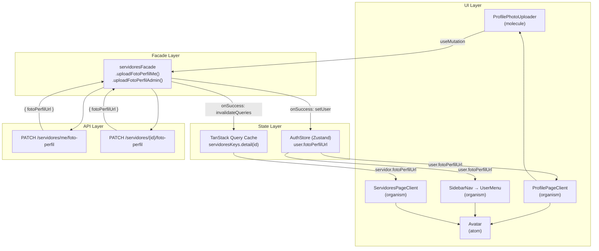

# Design Document — profile-photo

## Overview

Esta feature adiciona suporte a **foto de perfil de servidor** no admin panel GovMobile. O fluxo cobre dois casos de uso: o servidor autenticado atualizando sua própria foto via `PATCH /servidores/me/foto-perfil`, e o administrador definindo a foto de qualquer servidor via `PATCH /servidores/{id}/foto-perfil`.

O backend é responsável por redimensionar (400×400 px), converter para WebP, armazenar no CDN e retornar a URL pública. O frontend valida o arquivo localmente (tipo MIME e tamanho), exibe preview, envia via `multipart/form-data` e propaga a nova URL para todos os pontos da UI que exibem o avatar.

### Decisões de design

- **Sem novo store**: a URL da foto é armazenada diretamente no `AuthStore` (campo `fotoPerfilUrl` em `AuthUser`) para o usuário autenticado, e no cache TanStack Query para servidores gerenciados pelo admin. Isso segue o modelo de dois layers do ADR-003.
- **Extensão do facade existente**: os métodos de upload são adicionados ao `servidoresFacade` em vez de criar um facade separado, mantendo coesão com as demais operações de servidor.
- **Molecule `ProfilePhotoUploader`**: componente autocontido que encapsula seleção, validação, preview e envio. Pode ser composto em `ProfilePageClient` (modo próprio) e em `ServidorFormDialog` / tela de detalhes (modo admin).

---

## Architecture



### Fluxo de upload (próprio servidor)

1. Usuário seleciona arquivo no `ProfilePhotoUploader`.
2. Validação local: tipo MIME e tamanho. Se inválido, exibe erro e para.
3. Exibe preview via `URL.createObjectURL`.
4. Usuário confirma envio.
5. `useUploadFotoPerfilMe` chama `servidoresFacade.uploadFotoPerfilMe(file)`.
6. Facade monta `FormData` com campo `foto` e envia `PATCH /servidores/me/foto-perfil`.
7. Em `onSuccess`: `authStore.setUser({ ...user, fotoPerfilUrl })`.
8. Todos os `Avatar` que leem `user.fotoPerfilUrl` do store re-renderizam automaticamente.

### Fluxo de upload (admin)

1–4. Idêntico ao fluxo próprio, mas o componente recebe `servidorId` como prop.
5. `useUploadFotoPerfilAdmin` chama `servidoresFacade.uploadFotoPerfilAdmin(id, file)`.
6. Facade envia `PATCH /servidores/{id}/foto-perfil`.
7. Em `onSuccess`: `queryClient.invalidateQueries(servidoresKeys.detail(id))` e `servidoresKeys.list()`.
8. TanStack Query refetch atualiza a listagem e os detalhes do servidor.

---

## Components and Interfaces

### Novos componentes

#### `ProfilePhotoUploader` (molecule)

```typescript
interface ProfilePhotoUploaderProps {
  /** "me" para o próprio servidor; "admin" para upload administrativo */
  mode: "me" | "admin";
  /** Obrigatório quando mode === "admin" */
  servidorId?: string;
  /** Nome do servidor — usado no aria-label do Avatar de preview */
  servidorNome: string;
  /** URL atual da foto (para exibir avatar existente antes de nova seleção) */
  currentFotoUrl?: string | null;
  /** Callback chamado após upload bem-sucedido com a nova URL */
  onSuccess?: (fotoPerfilUrl: string) => void;
}
```

Responsabilidades:
- Renderiza `<input type="file" accept="image/jpeg,image/png,image/webp">` com `<label>` associado.
- Valida tipo MIME e tamanho (≤ 5 MB) antes do envio.
- Exibe preview via `URL.createObjectURL` após seleção válida.
- Chama `useUploadFotoPerfilMe` ou `useUploadFotoPerfilAdmin` conforme `mode`.
- Exibe estado de loading (spinner + botão desabilitado) durante o upload.
- Exibe mensagens de erro com `aria-invalid` e `aria-describedby`.
- Usa chaves i18n para todos os textos.

### Novos hooks

#### `useUploadFotoPerfilMe`

```typescript
// src/hooks/servidores/useUploadFotoPerfilMe.ts
function useUploadFotoPerfilMe(): UseMutationResult<
  { fotoPerfilUrl: string },
  ApiError,
  File
>
```

- `mutationFn`: chama `servidoresFacade.uploadFotoPerfilMe(file)`.
- `onSuccess`: chama `authStore.setUser({ ...user, fotoPerfilUrl })`.
- `onError`: expõe o `ApiError` para o componente tratar.

#### `useUploadFotoPerfilAdmin`

```typescript
// src/hooks/servidores/useUploadFotoPerfilAdmin.ts
function useUploadFotoPerfilAdmin(): UseMutationResult<
  { fotoPerfilUrl: string },
  ApiError,
  { id: string; file: File }
>
```

- `mutationFn`: chama `servidoresFacade.uploadFotoPerfilAdmin(id, file)`.
- `onSuccess`: invalida `servidoresKeys.detail(id)` e `servidoresKeys.list()`.
- `onError`: expõe o `ApiError` para o componente tratar.

### Extensões de facades existentes

#### `servidoresFacade` — novos métodos

```typescript
// Adicionados ao objeto servidoresFacade em src/facades/servidoresFacade.ts

/**
 * Faz upload da foto de perfil do servidor autenticado.
 * PATCH /servidores/me/foto-perfil
 */
async uploadFotoPerfilMe(file: File): Promise<{ fotoPerfilUrl: string }>

/**
 * Faz upload da foto de perfil de um servidor específico (admin only).
 * PATCH /servidores/{id}/foto-perfil
 */
async uploadFotoPerfilAdmin(id: string, file: File): Promise<{ fotoPerfilUrl: string }>
```

Ambos montam `FormData` com campo `foto` e usam `fetchWithAuth` com `method: "PATCH"`. Não definem `Content-Type` manualmente — o browser define automaticamente com o boundary correto ao usar `FormData`.

### Extensões de modelos existentes

#### `AuthUser` (src/models/Auth.ts)

```typescript
export interface AuthUser {
  // ... campos existentes ...
  /** URL pública da foto de perfil, ou null quando não definida. */
  fotoPerfilUrl?: string | null;
}
```

#### `Servidor` (src/models/Servidor.ts)

```typescript
export interface Servidor {
  // ... campos existentes ...
  /** URL pública da foto de perfil, ou null quando não definida. */
  fotoPerfilUrl?: string | null;
}
```

### Extensão do `AuthStore`

Adicionar ação `updateFotoPerfilUrl` para atualização cirúrgica sem substituir o objeto `user` inteiro:

```typescript
// Adicionado a AuthActions
updateFotoPerfilUrl: (url: string) => void;

// Implementação
updateFotoPerfilUrl: (url) =>
  set((state) => ({
    user: state.user ? { ...state.user, fotoPerfilUrl: url } : state.user,
  })),
```

### Componentes existentes — modificações

| Componente | Modificação |
|---|---|
| `ProfilePageClient` | Adiciona `ProfilePhotoUploader` com `mode="me"` acima da tabela de identidade. |
| `SidebarNav` / `UserMenu` | Já recebe `userAvatarUrl` — sem mudança estrutural. O `AdminShell` passa `user.fotoPerfilUrl` do store. |
| `ServidoresPageClient` / `ServidorRow` | Adiciona `Avatar` com `src={servidor.fotoPerfilUrl}` na coluna de nome. |
| `AdminShell` | Passa `user?.fotoPerfilUrl` para `SidebarNav`. |

### Novo MSW handler

```typescript
// src/msw/servidoresHandlers.ts (novo arquivo)
// PATCH /servidores/me/foto-perfil
// PATCH /servidores/:id/foto-perfil
// Cenários: 200, 400, 413, 404
```

---

## Data Models

### `UploadFotoPerfilResponse`

```typescript
/** Resposta de PATCH /servidores/me/foto-perfil e PATCH /servidores/{id}/foto-perfil */
export interface UploadFotoPerfilResponse {
  fotoPerfilUrl: string;
}
```

### Validação local de arquivo

```typescript
const ALLOWED_MIME_TYPES = ["image/jpeg", "image/png", "image/webp"] as const;
const MAX_FILE_SIZE_BYTES = 5 * 1024 * 1024; // 5 MB

type MimeType = (typeof ALLOWED_MIME_TYPES)[number];

interface FileValidationResult {
  valid: boolean;
  error?: "INVALID_TYPE" | "FILE_TOO_LARGE";
}

function validateFile(file: File): FileValidationResult {
  if (!ALLOWED_MIME_TYPES.includes(file.type as MimeType)) {
    return { valid: false, error: "INVALID_TYPE" };
  }
  if (file.size > MAX_FILE_SIZE_BYTES) {
    return { valid: false, error: "FILE_TOO_LARGE" };
  }
  return { valid: true };
}
```

### Chaves i18n (namespace `servidores`)

```json
{
  "profilePhoto": {
    "label": "Foto de perfil",
    "buttonSelect": "Selecionar foto",
    "buttonSend": "Enviar foto",
    "buttonChange": "Alterar foto",
    "preview": "Pré-visualização da foto selecionada",
    "uploading": "Enviando...",
    "errors": {
      "invalidType": "Tipo de arquivo não permitido. Use JPEG, PNG ou WebP.",
      "fileTooLarge": "O arquivo excede o tamanho máximo de 5 MB.",
      "invalidFile": "O arquivo é inválido ou corrompido.",
      "serverNotFound": "Servidor não encontrado.",
      "serverError": "Erro ao enviar a foto. Tente novamente."
    },
    "success": "Foto de perfil atualizada com sucesso."
  }
}
```

---

## Correctness Properties

*A property is a characteristic or behavior that should hold true across all valid executions of a system — essentially, a formal statement about what the system should do. Properties serve as the bridge between human-readable specifications and machine-verifiable correctness guarantees.*

### Property 1: Validação de tipo MIME é exaustiva e correta

*For any* string de tipo MIME, a função `validateFile` SHALL retornar `valid: true` se e somente se o tipo for exatamente `"image/jpeg"`, `"image/png"` ou `"image/webp"`, e `valid: false` com `error: "INVALID_TYPE"` para qualquer outro valor.

**Validates: Requirements 1.1**

### Property 2: Validação de tamanho respeita o limite de 5 MB

*For any* tamanho de arquivo em bytes, a função `validateFile` SHALL retornar `valid: false` com `error: "FILE_TOO_LARGE"` quando `size > 5_242_880`, e `valid: true` quando `size <= 5_242_880` (assumindo tipo MIME válido).

**Validates: Requirements 1.3**

### Property 3: Upload próprio atualiza o AuthStore com a URL retornada

*For any* URL de foto de perfil retornada pela API, após uma chamada bem-sucedida a `uploadFotoPerfilMe`, o campo `user.fotoPerfilUrl` no `AuthStore` SHALL ser igual à URL retornada.

**Validates: Requirements 1.6**

### Property 4: Upload admin invalida o cache do servidor correto

*For any* identificador de servidor, após uma chamada bem-sucedida a `uploadFotoPerfilAdmin(id, file)`, o hook SHALL invocar `queryClient.invalidateQueries` com `servidoresKeys.detail(id)` e `servidoresKeys.list()`.

**Validates: Requirements 2.3**

### Property 5: Facade retorna a URL exatamente como recebida da API

*For any* string de URL retornada pelo backend em `{ fotoPerfilUrl }`, os métodos `uploadFotoPerfilMe` e `uploadFotoPerfilAdmin` SHALL retornar um objeto `{ fotoPerfilUrl }` com o mesmo valor, sem transformação.

**Validates: Requirements 4.3, 4.4**

### Property 6: Avatar sempre mantém aria-label igual ao nome, independente do src

*For any* string de nome e qualquer valor de `src` (URL válida, URL inválida ou ausente), o elemento raiz do `Avatar` SHALL ter `aria-label` igual ao nome fornecido.

**Validates: Requirements 5.5**

### Property 7: Erros de validação sempre ativam aria-invalid e aria-describedby

*For any* condição de erro no `ProfilePhotoUploader` (tipo inválido, tamanho excedido, erro 400, erro 413), o campo de input SHALL ter `aria-invalid="true"` e `aria-describedby` apontando para o elemento que contém a mensagem de erro.

**Validates: Requirements 5.3**

---

## Error Handling

### Erros de validação local (pré-envio)

| Condição | Ação |
|---|---|
| Tipo MIME não permitido | Exibe erro `profilePhoto.errors.invalidType`; não envia requisição |
| Tamanho > 5 MB | Exibe erro `profilePhoto.errors.fileTooLarge`; não envia requisição |

### Erros de API (pós-envio)

| Status HTTP | Mensagem exibida | Chave i18n |
|---|---|---|
| 400 | Arquivo inválido ou corrompido | `profilePhoto.errors.invalidFile` |
| 404 | Servidor não encontrado (admin only) | `profilePhoto.errors.serverNotFound` |
| 413 | Arquivo excede o tamanho máximo | `profilePhoto.errors.fileTooLarge` |
| 0 / rede | Erro de rede genérico | `common:errors.networkError` |
| 5xx | Erro de servidor genérico | `profilePhoto.errors.serverError` |

### Fallback do Avatar

Quando `src` está ausente ou a imagem falha ao carregar (`onError`), o `Avatar` exibe as iniciais derivadas do `name`. O estado de erro é local ao componente (`useState(false)` → `setImgError(true)` no `onError`). O `Avatar` existente já implementa esse comportamento — nenhuma mudança necessária.

### Limpeza de object URL

O `ProfilePhotoUploader` deve chamar `URL.revokeObjectURL(previewUrl)` no cleanup do `useEffect` que cria o preview, evitando memory leaks.

---

## Testing Strategy

### Abordagem dual

A estratégia combina testes de exemplo (comportamentos específicos e casos de borda) com testes baseados em propriedades (invariantes universais). A biblioteca de PBT é **fast-check** com integração **@fast-check/vitest**, já presentes no projeto.

### Testes de propriedade (fast-check)

Cada propriedade do design é implementada como um único teste de propriedade com mínimo de 100 iterações. Tag de referência: `Feature: profile-photo, Property N: <texto>`.

| Propriedade | Arquivo de teste | Geradores fast-check |
|---|---|---|
| P1 — Validação MIME exaustiva | `validateFile.test.ts` | `fc.string()` para tipos arbitrários |
| P2 — Validação de tamanho | `validateFile.test.ts` | `fc.integer({ min: 0, max: 20_000_000 })` |
| P3 — AuthStore atualizado com URL retornada | `useUploadFotoPerfilMe.test.ts` | `fc.webUrl()` para URLs arbitrárias |
| P4 — Cache invalidado para ID correto | `useUploadFotoPerfilAdmin.test.ts` | `fc.uuid()` para IDs arbitrários |
| P5 — Facade retorna URL sem transformação | `servidoresFacade.test.ts` | `fc.webUrl()` |
| P6 — Avatar aria-label sempre igual ao nome | `Avatar.test.tsx` | `fc.string()` para nomes, `fc.webUrl()` para src |
| P7 — Erros ativam aria-invalid + aria-describedby | `ProfilePhotoUploader.test.tsx` | `fc.constantFrom(...)` para condições de erro |

### Testes de exemplo (Vitest + Testing Library)

**`validateFile.test.ts`**
- Aceita `image/jpeg`, `image/png`, `image/webp` com tamanho válido.
- Rejeita `application/pdf`, `image/gif`, string vazia.
- Rejeita arquivo exatamente em 5_242_881 bytes; aceita em 5_242_880 bytes.

**`ProfilePhotoUploader.test.tsx`**
- Renderiza `<input type="file">` com `accept` correto e `<label>` associado.
- Exibe preview após seleção de arquivo válido.
- Exibe erro de tipo inválido sem chamar fetch.
- Exibe loading e botão desabilitado durante upload.
- Exibe erro correto para respostas 400 e 413 (via MSW).
- Botão de envio tem `aria-label` descritivo.
- Todos os textos visíveis são chaves i18n (sem strings hardcoded).

**`useUploadFotoPerfilMe.test.ts`**
- Chama `PATCH /servidores/me/foto-perfil` com `FormData` contendo campo `foto`.
- Atualiza `authStore.user.fotoPerfilUrl` em `onSuccess`.
- Expõe `ApiError` em `onError`.

**`useUploadFotoPerfilAdmin.test.ts`**
- Chama `PATCH /servidores/{id}/foto-perfil` com o ID correto.
- Invalida cache em `onSuccess`.
- Exibe erro 404 corretamente.

**`Avatar.test.tsx`** (complementar ao existente)
- Exibe iniciais quando `src` está ausente.
- Exibe iniciais após `onError` na imagem.
- `aria-label` é sempre o nome (coberto pela Property 6).

**`servidoresHandlers.ts`** (MSW)
- `PATCH /servidores/me/foto-perfil`: 200 com `{ fotoPerfilUrl }`, 400, 413.
- `PATCH /servidores/:id/foto-perfil`: 200 com `{ fotoPerfilUrl }`, 400, 404.

### Configuração de testes de propriedade

```typescript
// Exemplo de configuração para Property 1
import { test } from "@fast-check/vitest";
import * as fc from "fast-check";

// Feature: profile-photo, Property 1: Validação de tipo MIME é exaustiva e correta
test.prop([fc.string()])(
  "validateFile rejeita qualquer MIME type fora dos permitidos",
  (mimeType) => {
    const allowed = ["image/jpeg", "image/png", "image/webp"];
    const file = new File(["x"], "test", { type: mimeType });
    const result = validateFile(file);
    if (allowed.includes(mimeType)) {
      expect(result.error).not.toBe("INVALID_TYPE");
    } else {
      expect(result).toEqual({ valid: false, error: "INVALID_TYPE" });
    }
  },
  { numRuns: 100 }
);
```
